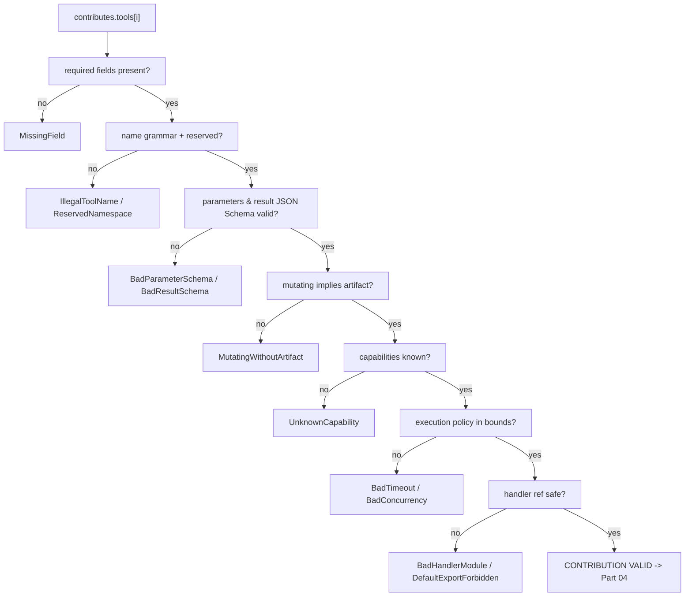
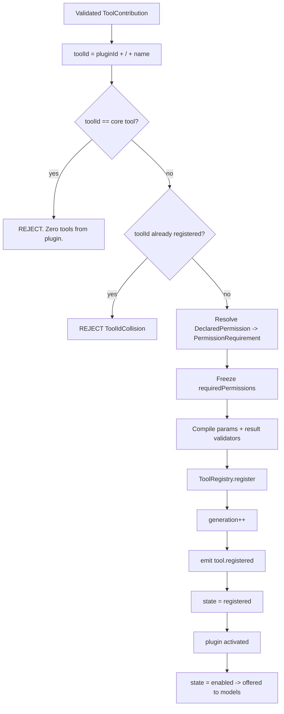
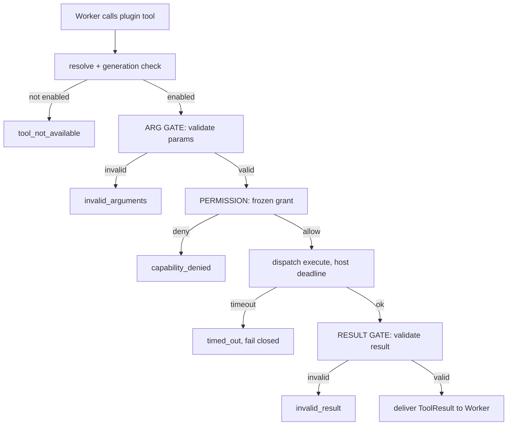
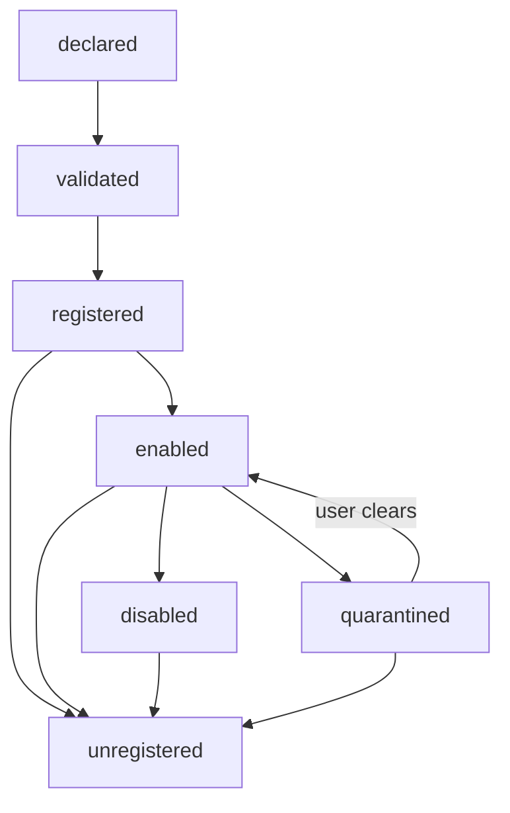

# ToolPlugins Diagrams

## Manifest Validation



## Registration, Namespacing, Collision



## Invocation Path: The Two Gates



## The Corridor Metaphor

```text
Worker -> [ARG GATE] -> Plugin -> [RESULT GATE] -> Worker

The plugin is a suspect in the middle of a corridor with a checkpoint
at each end. It is not trusted to validate its own input, and it is not
trusted to describe its own output honestly.
```

## Tool State Machine



## Related Documents

- [[09-plugin-system/README]]
- [[ToolPlugins-Part01]]
- [[ToolPlugins-Part02]]
- [[ToolPlugins-Part03]]
- [[ToolPlugins-Part04]]
- [[ToolPlugins-Part05]]
- [[PluginArchitecture-Part01]]
- [[PermissionManager-Part01]]
- [[ToolRegistry-Part01]]
- [[Tool-Part01]]
