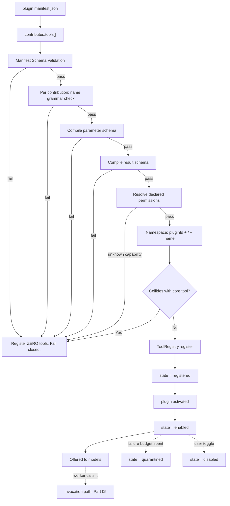

---
title: ToolPlugins Specification - Part 01
status: draft
version: 1.0
tags:
  - plugin-system
  - tool-plugins
  - tools
  - architecture
related:
  - "[[09-plugin-system/README]]"
  - "[[PluginArchitecture-Part01]]"
  - "[[ToolRegistry-Part01]]"
  - "[[Tool-Part01]]"
  - "[[PermissionManager-Part01]]"
---

# ToolPlugins Specification (Part 01)

## Document Index

```text
ToolPlugins-Part01 - Purpose, philosophy, object model, states, invariants
ToolPlugins-Part02 - The tool contribution manifest and its validation
ToolPlugins-Part03 - The tool definition, JSON Schemas, and description quality
ToolPlugins-Part04 - Registration into ToolRegistry: namespacing and collision rules
ToolPlugins-Part05 - The invocation path, validation gates, permissions, timeouts, cancellation
ToolPlugins-Diagrams - All flows in four representations
```

# Purpose

ToolPlugins defines how a third-party plugin contributes a Tool that a Worker can call.

This is the highest-risk extension point in Eulinx. Every other plugin surface either decorates the UI or observes events. A Tool is different: a Tool is code that an AI model chooses to run, with arguments the AI model wrote, on the user's machine.

```text
A HookSystem hook runs when Eulinx decides.
A NodePlugin node runs when a Workflow decides.
A ToolPlugin tool runs when a language model decides.

That last one is the reason this document is six parts long.
```

The contract this document defines is therefore not a convenience API. It is a containment boundary. The plugin author is not a colleague. The plugin author is an anonymous person on a marketplace, and the plugin may be actively hostile, merely incompetent, or perfectly good but built against an older version of Eulinx. All three MUST produce the same outcome: the core keeps running, the project on disk is untouched, and the Worker gets a typed error.

# Core Philosophy

**Plugins are UNTRUSTED third-party code.**

Every rule below is a restatement of that one sentence applied to a specific mechanism.

```text
Fail closed.
  An unparseable manifest contributes zero tools. Not "the tools we could read".

Sandbox by default.
  A tool gets no capability it did not declare and the user did not grant.

Gate on explicit permission.
  Declaration is a request, never a grant. PermissionManager grants.

Never let a plugin stall the core.
  Every invocation has a deadline. The deadline is enforced by the host, not the plugin.

The plugin does not touch the project.
  It returns data. It emits an Artifact. MergeManager decides.
```

There is one further principle that implementers consistently miss, so it is stated here rather than buried in Part 05.

**Eulinx validates on both sides of the plugin.** Arguments are validated against the parameter schema before the plugin sees them, and the result is validated against the result schema before the Worker sees it. The plugin is a suspect in the middle of a corridor with a checkpoint at each end. It is not trusted to validate its own input, and it is not trusted to describe its own output honestly.

```text
Worker -> [ARG GATE] -> Plugin -> [RESULT GATE] -> Worker
```

Remove either gate and a malformed plugin becomes a malformed Worker context, which becomes a malformed Artifact, which becomes a corrupt merge.

# Definition

A **ToolPlugin** is a plugin that declares one or more entries in the `contributes.tools` array of its plugin manifest, and ships a handler for each.

A **Tool Contribution** is a single entry in that array. It binds a tool name, a tool definition (description plus JSON Schemas), a permission requirement set, an execution policy, and a handler reference.

A **Plugin Tool** is the runtime object the ToolRegistry holds after a contribution has been validated, namespaced, permission-resolved, and registered.

These three are distinct and MUST NOT be conflated in code. The contribution is the declaration on disk. The plugin tool is the live registry entry. The invocation is one call against it.

```text
manifest.json                     -> ToolContribution   (declared, on disk, untrusted)
ToolRegistry.register(...)        -> PluginTool         (validated, live, namespaced)
worker calls Eulinx.fs.read_manifest -> ToolInvocation     (one call, one deadline)
```

This document does not define plugin loading, the sandbox mechanism, the SDK ergonomics, or the hook surface. Those are [[PluginArchitecture-Part01]], [[PluginLifecycle-Part01]], [[PluginSDK-Part01]], and [[HookSystem-Part01]]. This document defines only what happens between a manifest's `contributes.tools` entry and a Worker receiving a validated result.

# Responsibilities

The ToolPlugin subsystem MUST:

- reject any contribution whose manifest entry fails schema validation, and register zero tools from that plugin
- reject any contribution whose parameter schema or result schema is not a valid JSON Schema draft 2020-12 document
- reject any contribution whose declared name violates the naming grammar in Part 04
- namespace every registered tool under the owning plugin's id, with no exception and no opt-out
- resolve every declared permission to a concrete `PermissionRequirement` at registration time and freeze it
- validate arguments against the parameter schema before the handler is entered
- deny the invocation if PermissionManager does not grant every declared permission
- enforce a wall-clock deadline on every invocation from the host side
- abort the invocation and return a typed error when the deadline expires
- validate the handler's return value against the result schema before returning to the Worker
- emit an EventBus event at every gate: requested, permission-decided, validated, started, finished, failed
- record enough of the invocation for Replay per [[Replay-Part01]]

The ToolPlugin subsystem SHOULD:

- surface description quality warnings to the plugin author at registration time
- cache compiled JSON Schema validators per tool, keyed by plugin id plus plugin version
- report the p50 and p99 handler duration per tool to [[WorkerMetrics-Part01]]
- allow a user to disable an individual plugin tool without disabling the whole plugin

The ToolPlugin subsystem MUST NOT:

- allow a plugin to register a tool under a namespace it does not own
- allow a plugin to overwrite, shadow, or unregister a core tool
- allow a plugin to register a tool after its plugin has left the `activated` state
- allow a handler's declared permissions to widen at invocation time
- allow a handler to receive arguments that did not pass the parameter schema
- allow a handler's return value to reach the Worker unvalidated
- allow an invocation to run without a deadline
- allow a plugin tool to write to the project working tree
- allow a plugin's failure, panic, hang, or infinite loop to block the ExecutionEngine
- trust any field the plugin sets on the result envelope other than the payload itself

# ToolPlugin Object Model

```ts
/** One entry in manifest.contributes.tools. Untrusted until validated. */
type ToolContribution = {
  /** Local name, unnamespaced. Grammar in Part 04. Example: "read_manifest". */
  name: string;
  /** Human title for the settings UI. Not shown to the model. */
  displayName: string;
  /** The single most important field in this type. See Part 03. */
  description: string;
  /** JSON Schema draft 2020-12. MUST have type "object". */
  parameters: JsonSchemaObject;
  /** JSON Schema draft 2020-12. MUST have type "object". */
  result: JsonSchemaObject;
  /** Declares intent to read or mutate. See Part 05. */
  sideEffect: SideEffectDeclaration;
  /** Permissions REQUESTED. Never granted here. */
  permissions: DeclaredPermission[];
  /** Timeout, concurrency, cancellation policy. See Part 05. */
  execution: ToolExecutionPolicy;
  /** Module path relative to plugin root, plus exported symbol. */
  handler: HandlerRef;
  /** Optional. Hides the tool from models unless the flag is on. */
  experimental?: boolean;
  /** Optional. Semver range of the Eulinx tool ABI this tool targets. */
  apiVersion?: string;
};

type HandlerRef = {
  /** Relative POSIX path inside the plugin bundle. No "..", no absolute paths. */
  module: string;
  /** Named export. MUST NOT be "default". */
  export: string;
};

type SideEffectDeclaration = {
  kind: "read_only" | "mutating";
  /** Required when kind = "mutating". Names the artifact type produced. */
  producesArtifactType?: ArtifactTypeName;
  /** True if calling twice with identical args is safe. */
  idempotent: boolean;
  /** True if the tool touches the network. Drives permission gating. */
  network: boolean;
};

type DeclaredPermission = {
  capability: PluginCapabilityName;
  /** Scope narrows the capability. Empty scope = whole capability = usually denied. */
  scope: string[];
  /** Shown verbatim in the consent dialog. MUST be plain language. */
  reason: string;
};

type ToolExecutionPolicy = {
  /** Wall-clock milliseconds. 1..120000. Host clamps. See Part 05. */
  timeoutMs: number;
  /** Max simultaneous invocations of THIS tool across all Workers. 1..16. */
  maxConcurrent: number;
  /** Whether the handler honors an AbortSignal. */
  cancellable: boolean;
  /** What the host does when the deadline fires. See Part 05. */
  onTimeout: "abort_and_error" | "abort_and_kill_plugin";
};

/** The live registry entry. Constructed by Eulinx. Plugins never build this. */
type PluginTool = {
  /** Namespaced, globally unique. Example: "acme.deps/read_manifest". */
  toolId: string;
  pluginId: string;
  pluginVersion: string;
  /** The unnamespaced name from the contribution. */
  localName: string;
  definition: ToolDefinition;
  sideEffect: SideEffectDeclaration;
  /** Resolved and FROZEN at registration. Never re-read from the manifest. */
  requiredPermissions: PermissionRequirement[];
  execution: ToolExecutionPolicy;
  /** Compiled validators. Built once at registration. */
  validators: {
    params: CompiledSchema;
    result: CompiledSchema;
  };
  handlerRef: HandlerRef;
  state: PluginToolState;
  registeredAt: string;
  /** Set when state = "quarantined". Explains why. */
  quarantineReason?: string;
};

/** What the model actually sees. Derived from the contribution. */
type ToolDefinition = {
  name: string;
  description: string;
  parameters: JsonSchemaObject;
  result: JsonSchemaObject;
};
```

# States

A `PluginTool` has its own lifecycle, distinct from its plugin's lifecycle. A plugin can be healthy while one of its tools is quarantined.

```ts
type PluginToolState =
  | "declared"      // parsed from manifest, not yet validated
  | "validated"     // schemas compiled, name legal, permissions resolvable
  | "registered"    // present in ToolRegistry, not yet callable
  | "enabled"       // callable, permissions granted or grantable
  | "disabled"      // user turned it off; MUST NOT be offered to any model
  | "quarantined"   // host disabled it after repeated failures; see Part 05
  | "unregistered"; // removed from ToolRegistry; terminal
```

Legal transitions, and nothing else:

```text
declared     -> validated       schema + name + permission checks pass
declared     -> unregistered    any validation failure (fail closed)
validated    -> registered      ToolRegistry accepted the namespaced id
validated    -> unregistered    collision with a core tool, or namespace theft
registered   -> enabled         plugin reached "activated"
enabled      -> disabled        user action
disabled     -> enabled         user action
enabled      -> quarantined     failure budget exhausted (Part 05)
quarantined  -> enabled         user manually clears quarantine
registered   -> unregistered    plugin deactivated or uninstalled
enabled      -> unregistered    plugin deactivated or uninstalled
disabled     -> unregistered    plugin deactivated or uninstalled
quarantined  -> unregistered    plugin deactivated or uninstalled
```

Only a tool in `enabled` MUST be offered to a model. A tool in any other state MUST NOT appear in the tool list sent to a Provider, and a call naming it MUST fail with `tool_not_available`.

# Invariants

```text
Every registered plugin tool id begins with its owning plugin's id followed by "/".
No plugin tool id collides with a core tool id. Core wins. Always.
A plugin tool's requiredPermissions are a frozen snapshot taken at registration.
A plugin tool's schemas are compiled exactly once, at registration.
No handler is entered with arguments that failed the parameter schema.
No result reaches a Worker without passing the result schema.
Every invocation carries a deadline. There is no unbounded invocation.
Every invocation carries an AbortSignal, whether or not the handler reads it.
A read_only tool that emits an Artifact is a contract violation, not a feature.
A mutating tool that writes to the project working tree is a security incident.
A plugin tool failure never transitions the calling Worker out of "working".
The set of tools offered to a model is a pure function of registry state at turn start.
A tool removed mid-turn still resolves for in-flight calls, then stops resolving.
```

The last invariant is the one people get wrong. A model is given a tool list at the start of its turn and may call a tool 30 seconds later. If a user uninstalls the plugin in between, the call MUST fail cleanly with `tool_not_available`, not panic on a dangling handler reference. Part 04 defines the generation counter that makes this deterministic.

# Mermaid Diagram



# AI Notes

Do not let a plugin hand you a `PluginTool`. The plugin hands you a `ToolContribution`, which is JSON it wrote, which may contain anything. Eulinx constructs the `PluginTool`. If your code does `registry.add(manifest.contributes.tools[i])` you have handed the registry an attacker-controlled object with an attacker-controlled `toolId`.

Do not skip the result gate because "the plugin declared the schema, so it must match it". The plugin declaring a schema is exactly as trustworthy as the plugin declaring it is safe. A plugin that returns `{ok: true}` where the schema promised `{files: string[]}` will inject garbage into the Worker's context and the Worker will reason on it. Validate.

Do not implement the timeout inside the plugin's own code path, and do not implement it with a flag the handler is expected to check. A handler in an infinite loop never checks a flag. The deadline MUST be enforced from outside the handler by the host, on a mechanism that does not require the handler's cooperation. Part 05 names the mechanism per runtime.

Do not treat one failing tool as one failing plugin, and do not treat one failing plugin as one failing Worker. These are three independent blast radii and collapsing them is how a bad plugin takes down a run.

Do not let the description field be an afterthought. It is not documentation. It is the prompt. A tool with a perfect schema and a vague description will be called at the wrong time with plausible-looking wrong arguments, and every gate in this document will pass those arguments through, because they are schema-valid. The schema constrains shape. The description constrains intent. Part 03 is not optional reading.

Do not allow a plugin tool to write a file into the project. It feels harmless the first time. It breaks the single most important rule in Eulinx: AI output MUST NOT directly mutate trusted state. Part 06 defines what to do instead.

# Related Documents

- [[09-plugin-system/README]]
- [[ToolPlugins-Part02]]
- [[ToolPlugins-Part03]]
- [[ToolPlugins-Part04]]
- [[ToolPlugins-Part05]]
- [[ToolPlugins-Diagrams]]
- [[PluginArchitecture-Part01]]
- [[PluginLifecycle-Part01]]
- [[PluginSDK-Part01]]
- [[HookSystem-Part01]]
- [[ToolRegistry-Part01]]
- [[Tool-Part01]]
- [[PermissionManager-Part01]]
- [[ArtifactArchitecture-Part01]]
- [[MergeManager-Part01]]
</content>
</invoke>
