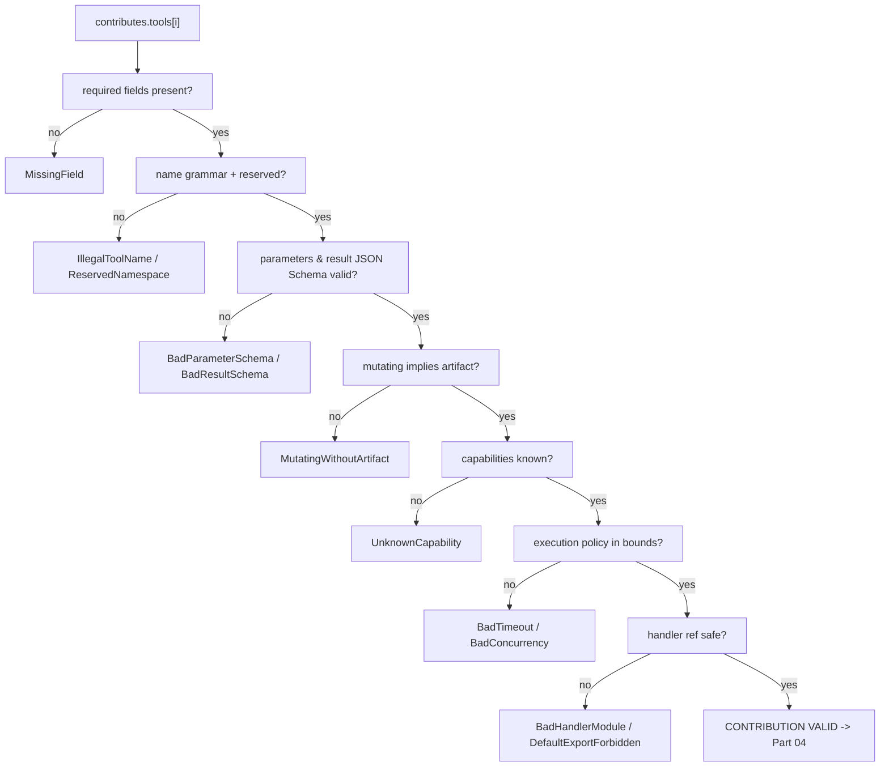

# ToolPlugins Specification (Part 02)

## Document Index

```text
ToolPlugins-Part01 - Purpose, philosophy, object model, states, invariants
ToolPlugins-Part02 - The tool contribution manifest and its validation
ToolPlugins-Part03 - The tool definition, JSON Schemas, and description quality
ToolPlugins-Part04 - Registration into ToolRegistry: namespacing and collision rules
ToolPlugins-Part05 - The invocation path, validation gates, permissions, timeouts, cancellation
ToolPlugins-Diagrams - All flows in four representations
```

# Purpose

This part defines the exact shape of a tool contribution as it appears in a plugin manifest, the schema that validates it, and the validation algorithm that runs at install time. A contribution that fails validation contributes **zero** tools. Not "the tools we could read"; zero. This is the first and most important gate a plugin meets.

# The Contribution In Context

A tool contribution is one entry of the `contributes.tools` array inside the plugin's root `Eulinx.plugin.json` manifest. See [[PluginArchitecture-Part02]] for the full manifest envelope. This document concerns only a single contribution object and its validation.

```text
Eulinx.plugin.json
  contributes:
    tools:
      - <ToolContribution>   <-- this document
      - <ToolContribution>
    nodes:    [...]          <-- see NodePlugins
    hooks:    [...]          <-- see HookSystem
```

# The Contribution Schema

```ts
type ToolContribution = {
  /** Local name, unnamespaced. Grammar defined below. */
  name: string;
  /** Human title for the settings UI. NEVER shown to the model. */
  displayName: string;
  /** The most important field. See Part 03. */
  description: string;
  /** JSON Schema draft 2020-12. MUST have type "object". */
  parameters: JsonSchemaObject;
  /** JSON Schema draft 2020-12. MUST have type "object". */
  result: JsonSchemaObject;
  sideEffect: SideEffectDeclaration;
  /** Capabilities REQUESTED, never granted here. */
  permissions: DeclaredPermission[];
  execution: ToolExecutionPolicy;
  handler: HandlerRef;
  /** Optional. Hides the tool from models unless a feature flag is on. */
  experimental?: boolean;
  /** Optional semver range of the Eulinx tool ABI this targets. */
  apiVersion?: string;
};
```

Every field is required unless marked `optional`. A missing required field is a validation failure, not a default. Defaults are hostile here because they let a plugin silently get a capability it never asked for.

# Name Grammar

The `name` field is a local identifier. It is namespaced at registration (Part 04), so it MUST NOT contain a `/`. It is subject to a closed grammar so that the eventual registry key is always safe to use as a routing prefix and a settings path segment.

```text
name    := segment ("." segment)*
segment := [a-z][a-z0-9_]*        (must start with a lowercase letter)
max length of name            = 64 characters
max segments                  = 5
max segment length            = 20
reserved segment "Eulinx"        = FORBIDDEN (Eulinx.* is core namespace)
reserved segment "internal"   = FORBIDDEN
```

```text
VALID     read_manifest
VALID     fs.stat
VALID     gh.pr.list
INVALID   ReadManifest     (uppercase)
INVALID   _read            (leading underscore)
INVALID   Eulinx.read         (reserved prefix)
INVALID   a/b              (contains slash)
INVALID   tool             (too vague; passes grammar but rejected by linter, see Part 03)
```

The grammar check is mechanical. The semantic check ("is this name descriptive enough") is a linter warning only and never blocks registration. Over-rejection by a linter would push authors to bypass validation; under-rejection is caught later by the description-quality check.

# SideEffectDeclaration

```ts
type SideEffectDeclaration = {
  kind: "read_only" | "mutating";
  producesArtifactType?: ArtifactTypeName;
  idempotent: boolean;
  network: boolean;
};
```

- `kind: "read_only"` means the tool does not cause observable change. A read_only tool declares it will not emit an artifact that mutates the project.
- `kind: "mutating"` REQUIRES `producesArtifactType`. The tool MUST return its change as an Artifact (see Part 06), never by writing the working tree.
- `idempotent: true` lets the host safely retry the call once on a transient transport error. If `false`, the host MUST NOT retry, because a retry could double-apply a side effect.
- `network: true` forces the permission gate to require a network capability. A network tool that forgets to declare it is rejected at `permissions` resolution (Part 05), not silently allowed.

# DeclaredPermission

```ts
type DeclaredPermission = {
  capability: PluginCapabilityName;
  scope: string[];
  reason: string;
};
```

- `capability` MUST be one of the closed set enumerated in [[PluginArchitecture-Part04]]. An unknown capability name is a hard validation failure.
- `scope` narrows the capability. `[]` means "the entire capability", which is almost always denied by the consent UI; authors SHOULD name specific resources (paths, hosts, tool ids).
- `reason` is plain language shown verbatim in the consent dialog. It MUST NOT contain markup, and MUST be length-capped to 140 characters. A reason that is empty or contains `<` is rejected.

# ToolExecutionPolicy

```ts
type ToolExecutionPolicy = {
  timeoutMs: number;
  maxConcurrent: number;
  cancellable: boolean;
  onTimeout: "abort_and_error" | "abort_and_kill_plugin";
};
```

- `timeoutMs` MUST be an integer in `[1, 120000]`. The host clamps any out-of-range value to the nearest bound and records a `tool_policy_clamped` event.
- `maxConcurrent` MUST be an integer in `[1, 16]`.
- `onTimeout` selects host behavior. `"abort_and_kill_plugin"` is permitted ONLY if the plugin declared the `process.self_terminate` capability, which it almost never should. Otherwise the host substitutes `"abort_and_error"`.

# HandlerRef

```ts
type HandlerRef = {
  module: string;
  export: string;
};
```

- `module` is a POSIX-relative path inside the plugin bundle. It MUST NOT contain `..`, an absolute component, or a leading `/`. It MUST end in `.js` or `.ts` and resolve to a file under the bundle root after manifest validation.
- `export` is a named export. It MUST NOT be `"default"`. A plugin that exports its handler as default is rejected; default exports encourage opaque module side effects.

# Validation Algorithm

Run once per contribution at install time, in order. Stop at the first failure and mark the whole manifest `tool_invalid`. The host records the failing check name and the offending JSON Pointer.

```text
1. requiredFieldPresent(contribution, [name, displayName, description,
     parameters, result, sideEffect, permissions, execution, handler])
       fail -> MissingField
2. nameMatchesGrammar(contribution.name)
       fail -> IllegalToolName
3. noReservedSegment(contribution.name)
       fail -> ReservedNamespace
4. parameters is JSON Schema 2020-12 AND type == "object"
       fail -> BadParameterSchema
5. result is JSON Schema 2020-12 AND type == "object"
       fail -> BadResultSchema
6. sideEffect.kind == "mutating" implies producesArtifactType present
       fail -> MutatingWithoutArtifact
7. every permissions[*].capability in CAPABILITY_REGISTRY
       fail -> UnknownCapability
8. every permissions[*].reason is non-empty, no markup, <= 140 chars
       fail -> BadPermissionReason
9. execution.timeoutMs integer in [1, 120000]
       fail -> BadTimeout
10. execution.maxConcurrent integer in [1, 16]
       fail -> BadConcurrency
11. execution.onTimeout == "abort_and_kill_plugin"
        implies plugin declared process.self_terminate  -> else coerce
12. handler.module path-safe and bundle-resolvable
       fail -> BadHandlerModule
13. handler.export != "default"
       fail -> DefaultExportForbidden
14. apiVersion (if present) parses as a valid semver range
       fail -> BadApiVersion
```

Each failure is attributed to the plugin id and persisted to the audit log. A single failing contribution invalidates every tool from that plugin (fail closed).

# Mermaid Diagram



# AI Notes

Do not add a default `permissions` of `[]` and treat that as "no permission needed". An empty declared permission set is a valid, meaningful statement: this tool needs nothing. It is NOT a signal to infer capabilities from behavior at runtime. Inference at runtime is an escalation path, which is forbidden.

Do not silently coerce a bad `timeoutMs` and continue as if nothing happened. Coercion is allowed for out-of-range numerics because it always makes the tool *more* restricted (smaller timeout, smaller concurrency). Any other defect is a hard failure. Record the coercion.

Do not let `description` pass here. Description quality is checked in Part 03, and a vague description is a linter warning, not a block. Blocking on prose quality invites authors to write filler that passes the check; the real defense is the model-facing schema plus the human-facing consent.

Do not accept an absolute or `..`-containing `module` path because "the bundle is zipped so it cannot escape". The bundle is unpacked to disk to be executed. A `module: "../../Eulinx/runtime"` is a real path traversal that would load Eulinx's own code into the plugin's context, which is a control-flow hijack.

# Related Documents

- [[09-plugin-system/README]]
- [[PluginArchitecture-Part02]]
- [[PluginArchitecture-Part04]]
- [[ToolPlugins-Part01]]
- [[ToolPlugins-Part03]]
- [[ToolPlugins-Part04]]
- [[ToolPlugins-Part05]]
- [[ToolPlugins-Diagrams]]
- [[ToolRegistry-Part01]]
- [[PermissionManager-Part01]]
