# ToolPlugins Specification (Part 03)

## Document Index

```text
ToolPlugins-Part01 - Purpose, philosophy, object model, states, invariants
ToolPlugins-Part02 - The tool contribution manifest and its validation
ToolPlugins-Part03 - The tool definition, JSON Schemas, and description quality
ToolPlugins-Part04 - Registration into ToolRegistry: namespacing and collision rules
ToolPlugins-Part05 - The invocation path, validation gates, permissions, timeouts, cancellation
ToolPlugins-Diagrams - All flows in four representations
```

# Purpose

This part defines the model-facing `ToolDefinition` (description plus JSON Schemas) and the rules that make it safe to hand to a language model. The schema constrains *shape*; the description constrains *intent*. Both are required because a tool that is shape-valid but intent-ambiguous will be called at the wrong time with plausible wrong arguments, and every downstream gate will happily pass them through.

# The ToolDefinition

```ts
type ToolDefinition = {
  name: string;
  description: string;
  parameters: JsonSchemaObject;
  result: JsonSchemaObject;
};
```

The `name` here is the *namespaced* registry id (`acme.deps/read_manifest`), set by the host at registration (Part 04), never by the plugin.

# JSON Schema Constraints

Plugin parameter and result schemas MUST be valid JSON Schema draft 2020-12 and MUST obey the following restricted dialect. The restriction exists because a plugin could otherwise smuggle executable intent through schema keywords.

```text
ALLOWED keywords:
  type, properties, required, additionalProperties, items, prefixItems,
  enum, const, minimum, maximum, exclusiveMinimum, exclusiveMaximum,
  minLength, maxLength, pattern, format, minItems, maxItems, uniqueItems,
  default, nullable, description, title, examples

FORBIDDEN keywords (rejected at validation):
  $ref, $dynamicRef, $id, $schema, $anchor, $recursiveRef, $recursiveAnchor
  if, then, else, allOf, anyOf, oneOf, not
  dependentRequired, dependentSchemas, propertyNames
  contentEncoding, contentMediaType, contentSchema
  patternProperties
```

```text
MUST:  type == "object" at the root of both parameters and result.
MUST:  properties is a non-empty object for parameters (a tool with no
       params is still an object, possibly empty additionalProperties:false).
MUST:  additionalProperties == false for parameters, to stop argument
       smuggling via unknown keys.
SHOULD: every property carries a "description" (drives model understanding).
MUST NOT: a property schema allow a function, a type "null" without nullable.
MUST NOT: pattern with catastrophic-backtracking risk (host runs a
       regex complexity check; fail closed on suspect patterns).
```

`$ref` is forbidden because a remote or bundled `$ref` is a fetch or a path that the host must resolve and validate; resolving arbitrary references is an attack surface. The restricted dialect is closed and fully inlinable, so the host compiles it once and needs no resolver at call time.

# Description Quality

The `description` is not documentation. It is the prompt. A model decides whether and how to call the tool based almost entirely on this string. Therefore:

```text
LENGTH:    40..600 characters. Under 40 is rejected (too vague to be safe).
           Over 600 is rejected (prompt-budget abuse / obfuscation).
ENCODING:  UTF-8, no control characters, no RTL overrides.
MARKUP:    MUST NOT contain "<", ">", "{", "}" other than JSON examples,
           or any templating syntax. It is prose, not a template.
DECEPTION: MUST NOT instruct the model to ignore prior instructions,
           MUST NOT request secrets, MUST NOT name other tools to call.
LANGUAGE:  Enforced single language matching the plugin manifest locale.
```

A description that *passes* length and encoding but is graded low-quality by the linter (e.g., "Does stuff") emits `tool_description_low_quality` and is shown to the author at registration, but does NOT block. Over-blocking here causes authors to write padding. The host additionally computes a "call-intent clarity" score; if below threshold AND the tool declares a mutating or network side effect, the consent dialog shows a warning line so the user grants with eyes open.

# Examples In Schema

`examples` on properties are encouraged and are treated as untrusted text that may enter a prompt. They MUST be length-capped (each <= 200 chars) and are subject to the same markup filter as descriptions. The host renders them inside a fenced `json` block in the model-facing definition, never as free prose.

# Result Schema And Failure Modeling

The `result` schema describes the *success* payload only. Failures are never part of the result schema; they travel in the `ToolResult` envelope's error channel (Part 05). This separation is load-bearing: a model must be able to rely on the schema for the happy path, while the host owns all failure representation.

```ts
type ToolResult =
  | { ok: true; data: JsonValue }       // validated vs result schema
  | { ok: false; error: ToolError };    // host-owned, never plugin-shaped

type ToolError = {
  code: string;       // namespaced: acme.deps/read_manifest:ENOENT
  message: string;    // length-capped, markup-stripped
  retryable: boolean; // drives host retry policy
};
```

# Mermaid Diagram

```mermaid
flowchart TD
  A["ToolDefinition from contribution"] --> B["Root type == object?"]
  B -->|"no"| F1["BadRootType"]
  B -->|"yes"| C["Restricted dialect? no $ref/allOf/etc"]
  C -->|"forbidden kw"| F2["SchemaKeywordForbidden"]
  C -->|"ok"| D["additionalProperties:false (params)?"]
  D -->|"no"| F3["OpenParams"]
  D -->|"yes"| E["description length + markup?"]
  E -->|"bad"| F4["BadDescription"]
  E -->|"ok"| F5["compile validators"]
  F5 --> G["ToolDefinition ready for registry"]
```



# AI Notes

Do not let a plugin put `$ref` in its schema "because it is cleaner". A `$ref` is a resolution the host must perform, and a resolution is a place where a crafted pointer reaches files or URLs. The restricted dialect is fully inlineable; there is no legitimate need for references in a tool schema.

Do not let the description be an afterthought and do not let it be a template. Both failure modes converge on the same disaster: a model that calls the tool with attacker-shaped arguments. A description containing `{{secret}}` or "ignore previous instructions" is a prompt-injection delivery vehicle, and the model is the one reading it.

Do not return errors inside the `data` field and call it success. The result schema is the success contract. If the plugin cannot satisfy it, it MUST return `ok:false` and let the host own the error envelope. A plugin that reports failure through `data` defeats every downstream error handler.

Do not allow `additionalProperties: true` on parameters. Unknown keys are how a plugin smuggles extra arguments past the arg gate and the model's own understanding. Closed parameters are not a limitation; they are the gate.

# Related Documents

- [[09-plugin-system/README]]
- [[ToolPlugins-Part01]]
- [[ToolPlugins-Part02]]
- [[ToolPlugins-Part04]]
- [[ToolPlugins-Part05]]
- [[ToolPlugins-Diagrams]]
- [[PluginArchitecture-Part04]]
- [[ToolRegistry-Part01]]
- [[PermissionManager-Part01]]
