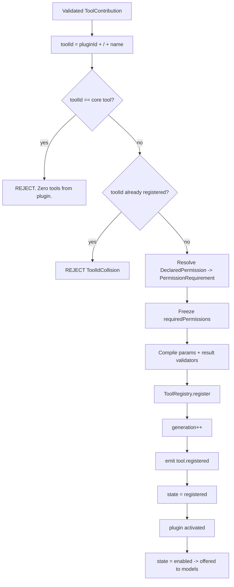

---
title: ToolPlugins Specification - Part 04
status: draft
version: 1.0
tags:
  - plugin-system
  - tool-plugins
  - tool-registry
  - namespacing
related:
  - "[[09-plugin-system/README]]"
  - "[[ToolPlugins-Part01]]"
  - "[[ToolPlugins-Part03]]"
  - "[[ToolPlugins-Part05]]"
  - "[[ToolRegistry-Part01]]"
  - "[[PermissionManager-Part01]]"
---

# ToolPlugins Specification (Part 04)

## Document Index

```text
ToolPlugins-Part01 - Purpose, philosophy, object model, states, invariants
ToolPlugins-Part02 - The tool contribution manifest and its validation
ToolPlugins-Part03 - The tool definition, JSON Schemas, and description quality
ToolPlugins-Part04 - Registration into ToolRegistry: namespacing and collision rules
ToolPlugins-Part05 - The invocation path, validation gates, permissions, timeouts, cancellation
ToolPlugins-Diagrams - All flows in four representations
```

# Purpose

This part defines how a validated `ToolContribution` becomes a live `PluginTool` inside [[ToolRegistry-Part01]]. Registration is where namespacing, collision rules, permission freezing, and the generation counter are decided. It is the boundary between "the plugin declared something" and "Eulinx now offers it to a model".

# The Registry Contract

ToolRegistry stores tools by a globally unique `toolId`. Core tools use the `Eulinx.` namespace and plugin tools use `<pluginId>/<name>`. See [[ToolRegistry-Part01]] for the store internals; this part defines the plugin-specific rules.

```ts
type PluginTool = {
  toolId: string;          // "<pluginId>/<name>"
  pluginId: string;
  pluginVersion: string;
  localName: string;
  definition: ToolDefinition;
  sideEffect: SideEffectDeclaration;
  requiredPermissions: PermissionRequirement[];
  execution: ToolExecutionPolicy;
  validators: { params: CompiledSchema; result: CompiledSchema };
  handlerRef: HandlerRef;
  state: PluginToolState;
  registeredAt: string;
  quarantineReason?: string;
};
```

# Namespacing Algorithm

```text
toolId = pluginId + "/" + contribution.name

where pluginId is the verified id from the installed + signature-checked
manifest (see PluginLifecycle-Part03), NEVER a value the plugin supplies
at registration time.
```

The pluginId is itself governed by a grammar (see [[PluginArchitecture-Part02]]) and is assigned by the marketplace or generated at install; it is not the plugin's self-chosen display name. A plugin that tries to register under a pluginId other than its own (e.g., `Eulinx` or another plugin's id) is rejected with `NamespaceTheft`.

# Collision Rules

Collisions are resolved with a strict priority order. There is no negotiation and no fallback to a "similar" name.

```text
PRIORITY (highest first):
  1. Core tools            (Eulinx.* namespace). Always win. A plugin tool
     whose toolId would equal a core toolId is REJECTED, and the whole
     plugin contributes zero tools (fail closed).
  2. Earlier-installed plugin tools. When two plugins both map to the
     same toolId (only possible if two plugins share an id, which the
     id authority prevents), the already-registered one wins and the
     late one is rejected with ToolIdCollision.
  3. Within one plugin, duplicate local names are rejected at manifest
     validation (Part 02), so intra-plugin collision cannot occur here.
```

Because pluginIds are unique and the `toolId` is `pluginId/name`, cross-plugin collisions are mathematically impossible unless the id authority is compromised. If it is, the collision rule still contains the blast radius: the second registrant is rejected, and no core tool is ever shadowed.

# The Generation Counter

A model is handed a tool list at the start of its turn and may call a tool many seconds later. Between those moments the plugin may be disabled, uninstalled, or quarantined. The generation counter makes this deterministic.

```ts
type ToolRegistry = {
  generation: number;                 // bumped on ANY structural change
  tools: Map<string, PluginTool>;
};

function register(p: PluginTool): void {
  if (tools.has(p.toolId)) throw Collision;
  tools.set(p.toolId, p);
  generation++;                       // every registration bumps
}

function unregister(toolId: string): void {
  if (!tools.has(toolId)) return;
  tools.delete(toolId);
  generation++;                       // every removal bumps
}
```

The snapshot a model receives is `generation = N` at turn start. A call arriving later reads the *current* generation:

- if the tool still exists and `state == enabled`, dispatch.
- if the tool no longer exists (uninstalled/disabled/quarantined), return `tool_not_available`. No exception, no dangling handler reference.

The alternative — keeping a stale handler alive for in-flight calls — is rejected because it would let a disabled malicious plugin keep running code after the user disabled it. A disabled plugin stops *now*.

# Permission Freezing

At registration, every `DeclaredPermission` is resolved to a `PermissionRequirement` and **frozen**. The frozen snapshot is what enforcement uses at invocation time (Part 05). The manifest is never re-read for permission decisions.

```ts
type PermissionRequirement = {
  capability: PluginCapabilityName;
  scope: string[];
  granted: boolean;          // decided by consent gate at install (Lifecycle-Part05)
  reason: string;
};
```

A `granted: false` requirement is not an error. The tool still registers; it simply receives `CapabilityDenied` on the RPC it was never granted. This lets a user install a plugin while withholding a capability it asked for, and the plugin degrades gracefully instead of failing to install.

# Compiled Validators

The host compiles `parameters` and `result` into `CompiledSchema` objects exactly once, keyed by `pluginId + pluginVersion + contributionHash`. Compilation is expensive (schema walk); caching it means invocation-time validation is a cheap, allocation-free check. A cache entry is invalidated by any change to the contribution, which is detectable via the contribution hash stored on the `PluginTool`.

# ToolRegistry Events

Every registration mutation emits an EventBus event per [[EventBus-Part01]]:

```text
tool.registered     { toolId, pluginId, generation }
tool.unregistered   { toolId, pluginId, generation, reason }
tool.enabled        { toolId, pluginId }
tool.disabled       { toolId, pluginId }
tool.quarantined    { toolId, pluginId, reason }
```

These are observation events. They MUST NOT be used by a plugin to detect other plugins (see [[PluginArchitecture-Part08]] cross-plugin isolation).

# Mermaid Diagram



# AI Notes

Do not build the `toolId` from anything the plugin supplies at runtime. The plugin can send any string during `activate`; using it would let a plugin impersonate `Eulinx.fs.read`. The `toolId` is constructed solely from the verified installed manifest id and the contribution `name` validated in Part 02.

Do not let a plugin tool shadow a core tool even "just for this workspace". Core tools are the trusted floor. If a plugin could override `Eulinx.fs.write`, the entire trusted-state rule in Eulinx collapses. Core always wins, always.

Do not keep a disabled plugin's handler reference alive for in-flight calls "to avoid breaking the model's turn". That is exactly the mechanism by which a user clicking "disable" fails to stop malicious code. Disable means stop. In-flight calls already dispatched may finish under their deadline, but no new dispatch is permitted, and `generation` bumps so the model's next turn will not see the tool.

Do not re-read the manifest for permission decisions at call time. The frozen `requiredPermissions` is the law. Reading the manifest again means a plugin that swapped its manifest on disk between install and invocation could widen its own authority, which is the canonical escalation exploit.

# Related Documents

- [[09-plugin-system/README]]
- [[ToolPlugins-Part01]]
- [[ToolPlugins-Part02]]
- [[ToolPlugins-Part03]]
- [[ToolPlugins-Part05]]
- [[ToolPlugins-Diagrams]]
- [[ToolRegistry-Part01]]
- [[PermissionManager-Part01]]
- [[PluginArchitecture-Part02]]
- [[PluginArchitecture-Part04]]
- [[PluginLifecycle-Part05]]
