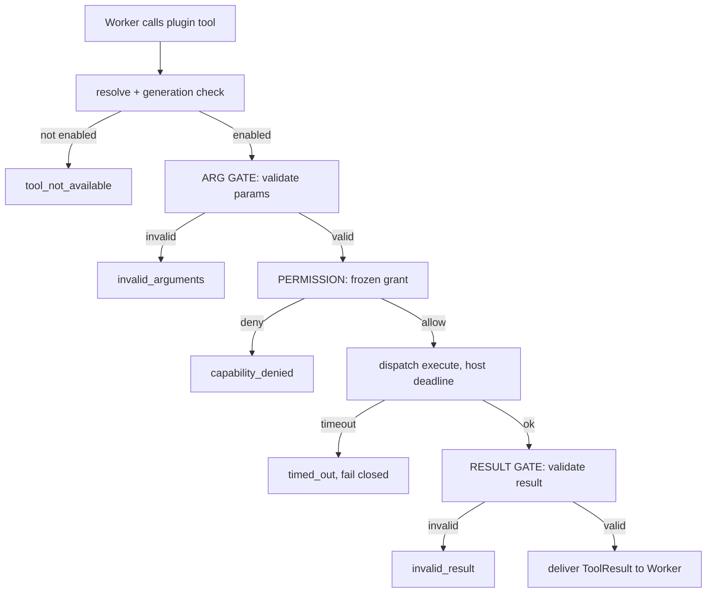

# ToolPlugins Specification (Part 05)

## Document Index

```text
ToolPlugins-Part01 - Purpose, philosophy, object model, states, invariants
ToolPlugins-Part02 - The tool contribution manifest and its validation
ToolPlugins-Part03 - The tool definition, JSON Schemas, and description quality
ToolPlugins-Part04 - Registration into ToolRegistry: namespacing and collision rules
ToolPlugins-Part05 - The invocation path, validation gates, permissions, timeouts, cancellation
ToolPlugins-Diagrams - All flows in four representations
```

# Purpose

This part defines the invocation path of a plugin tool: the two validation gates, the permission check, the host-owned timeout, cancellation, and the failure model. A tool runs when a language model decides to call it, which is why every gate here is non-negotiable.

# The Invocation Path

When a Worker calls a plugin tool, the path is:

```text
1. ToolRegistry resolves the toolId to the PluginTool (generation check)
2. if the tool is not in state enabled -> ToolResult error: tool_not_available
3. ARG GATE: validate args against the compiled params validator
4. if args invalid -> ToolResult error: invalid_arguments (fail closed)
5. PERMISSION: PermissionManager checks the frozen requiredPermissions
6. if denied -> ToolResult error: capability_denied
7. dispatch execute to the sandbox with a host-owned deadline
8. RESULT GATE: validate the return against the compiled result validator
9. if invalid -> ToolResult error: invalid_result (fail closed)
10. deliver the validated ToolResult to the Worker
```

Steps 3 and 8 are the two checkpoints around the untrusted plugin (described in Part 01). The plugin is a suspect in the middle of a corridor; neither gate is optional.

# The Argument Gate

Arguments are validated against the compiled `parameters` schema before the handler is entered. A handler is NEVER entered with arguments that failed the schema. This protects the plugin from malformed model input AND protects the Worker from a plugin that blames bad input for bad output. The validation uses the `CompiledSchema` built once at registration (Part 04), so it is cheap.

# The Permission Gate

The permission gate consults the FROZEN `requiredPermissions` from the grant record, never the manifest. For each declared capability, PermissionManager answers allow or deny based on the stored `granted` boolean and the requested scope. A single denied capability yields `capability_denied`; the other capabilities are not consulted for a "partial" run. The tool either runs fully authorized or does not run.

# The Host-Owned Timeout

Every invocation has a deadline computed by the host from `execution.timeoutMs` (clamped at registration, Part 02). The host starts a timer before dispatching into the plugin and abandons the call when it fires. The plugin cannot extend the timer. On expiry, the outcome is `timed_out` and, if `onTimeout` was `abort_and_kill_plugin` (and the plugin held the rare `process.self_terminate` capability), the host escalates; otherwise it returns `abort_and_error`. Either way the Worker gets a typed error, not a hang.

# Cancellation

The host passes an abort signal with every invocation. If the workflow or Worker is cancelled, the signal fires; the plugin is expected to stop; the host abandons the call regardless of cooperation and resolves with a cancellation error. A non-cooperative plugin is abandoned by the watchdog and eventually killed ([[PluginLifecycle-Part06]]).

# Idempotency And Retry

The host retries a call once on a transient transport error ONLY if `sideEffect.idempotent` is true. A mutating, non-idempotent tool is never retried, because a retry could double-apply a side effect. A `timed_out` call is never retried, because the original may have succeeded after the timer; retry would double-apply.

# Failure And Blast Radius

A tool failure is isolated to that call. It MUST NOT transition the calling Worker out of "working", MUST NOT crash the runtime, and MUST NOT disable the plugin unless the failure budget ([[PluginLifecycle-Part06]]) is exhausted. The three blast radii (tool, plugin, Worker) are independent; collapsing them is how a bad plugin takes down a run. Every failure is attributed to the plugin id and recorded for the circuit breaker.

# Invocation Invariants

```text
A tool not in state enabled returns tool_not_available.
Args are validated before the handler is entered.
The permission gate uses the frozen grant, never the manifest.
A denied capability yields capability_denied; no partial run.
Every invocation has a host-owned deadline; no infinite call.
The result is validated before the Worker sees it.
A non-idempotent call is never retried after a transient error.
A timed_out call is never retried.
A tool failure never crashes the core or stalls the Worker.
```

# Mermaid Diagram



# AI Notes

Do not skip the result gate because "the plugin declared the schema, so it matches". The plugin declaring a schema is exactly as trustworthy as the plugin declaring it is safe. A plugin that returns the wrong shape injects garbage into the Worker's context. Validate.

Do not implement the timeout inside the plugin's code path or with a flag it checks. A handler in an infinite loop never checks a flag. The deadline is host-owned and does not require the handler's cooperation.

Do not treat one failing tool as one failing plugin, or one failing plugin as one failing Worker. These are three independent blast radii; collapsing them takes down a run.

Do not retry a timed-out mutating call "to be sure". The original may have committed after the timer. Retry only idempotent, transient failures.

# Related Documents

- [[09-plugin-system/README]]
- [[ToolPlugins-Part01]]
- [[ToolPlugins-Part02]]
- [[ToolPlugins-Part03]]
- [[ToolPlugins-Part04]]
- [[ToolPlugins-Diagrams]]
- [[PluginArchitecture-Part04]]
- [[PluginArchitecture-Part05]]
- [[PermissionManager-Part01]]
- [[PluginLifecycle-Part06]]
- [[ToolRegistry-Part01]]
- [[Tool-Part01]]
