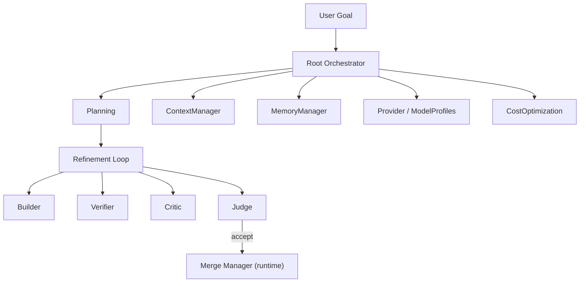
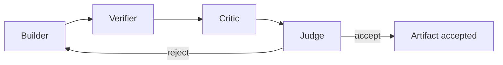

# AIArchitecture Diagrams

## Overall AI Subsystem



```text
User Goal
  -> Root Orchestrator
     -> Planning
     -> Refinement Loop (Builder/Verifier/Critic/Judge)
     -> Context, Memory, Provider, Cost
  -> Merge Manager (runtime)
```

## Role Flow



## AI Notes

Keep the reasoning layer above the runtime. The runtime owns execution, locks, and merges.

# Related Documents

- [[AIArchitecture-Part01]]
- [[RefinementLoop-Part01]]
