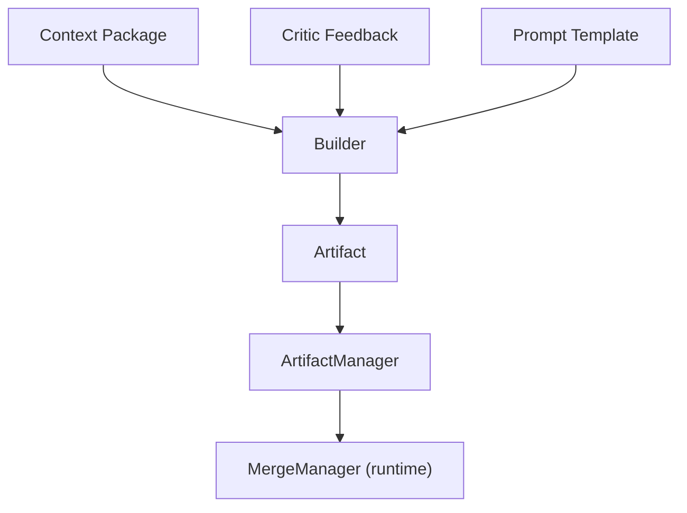

# Builder Diagrams

## Builder Flow



```text
Context + Feedback + Prompt -> Builder -> Artifact -> ArtifactManager -> MergeManager
```

## No Direct Mutation

```text
Builder  --produces-->  Artifact  --stored-->  ArtifactManager
                                         |
                                         v
                                    MergeManager (locks, conflicts)
                                         |
                                         v
                                    Workspace
```

# Related Documents

- [[Builder-Part01]]
- [[RefinementLoop-Part03]]
