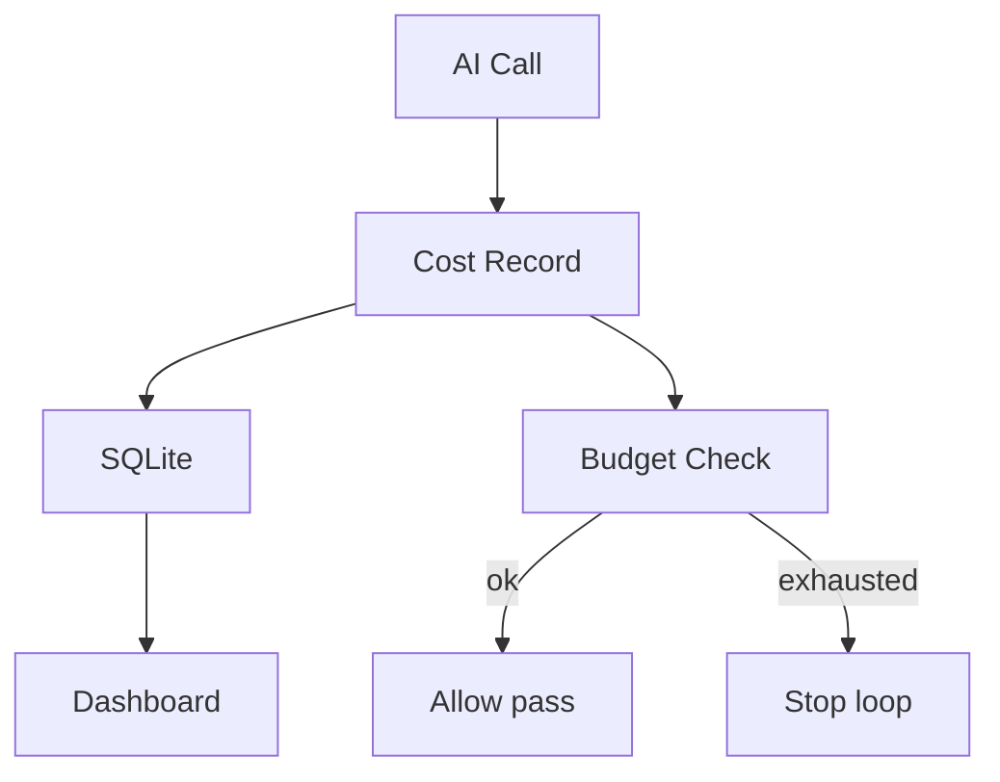

# CostOptimization Diagrams

## Cost Flow



```text
AI Call -> Cost Record -> (store + budget check)
budget ok   -> continue
budget low  -> stop / route cheaper
```

## Levels

```text
call -> worker -> task -> phase -> run -> workspace
```

# Related Documents

- [[CostOptimization-Part01]]
- [[RefinementLoop-Part04]]
