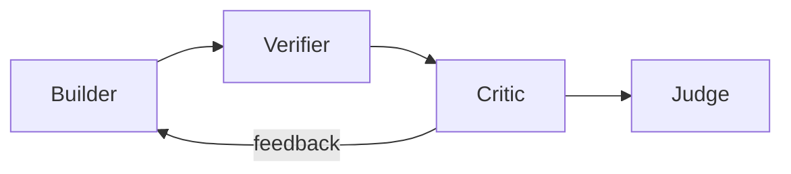

# Critic Diagrams

## Critic in the Loop



```text
Builder -> Verifier -> Critic -> Judge
              |
              +-> feedback -> Builder
```

## Critic Output Shape

```text
feedback:
  issues:     [ {severity, location, detail} ]
  strengths:  [ ... ]
  suggestions:[ ... ]
  questions:  [ ... ]
```

# Related Documents

- [[Critic-Part01]]
- [[RefinementLoop-Part03]]
