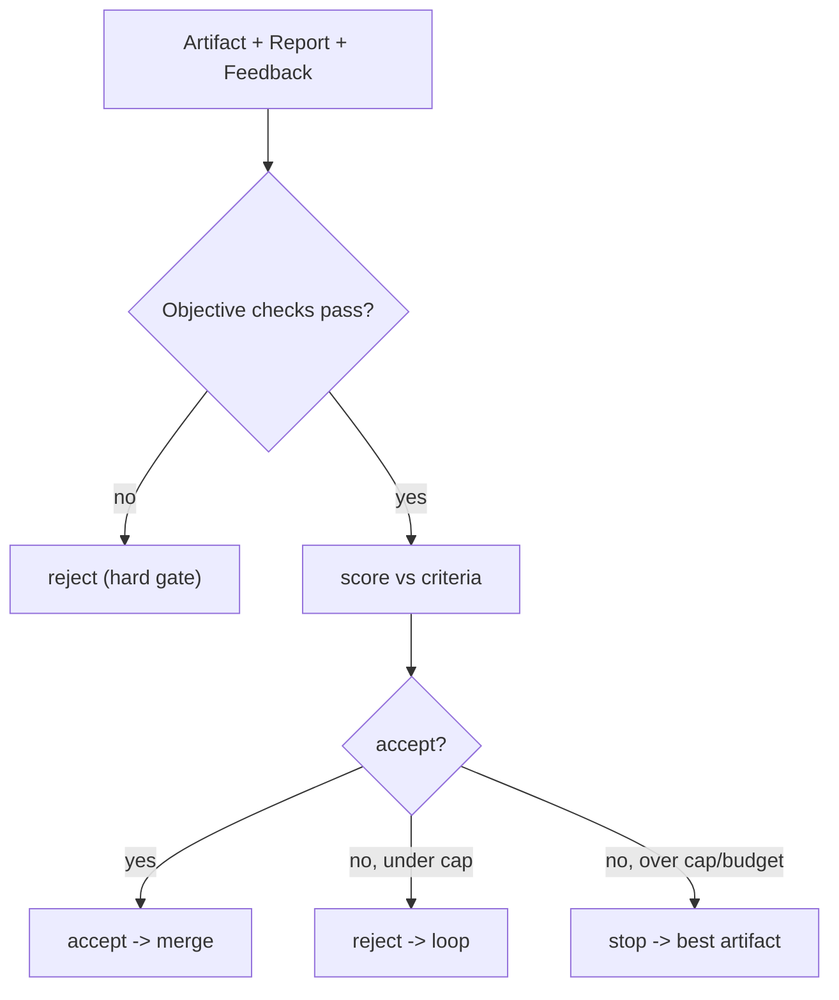

# Judge Diagrams

## Judge Decision



```text
Artifact -> objective gate -> score -> accept / reject / stop
```

# Related Documents

- [[Judge-Part01]]
- [[RefinementLoop-Part04]]
- [[Verifier-Part01]]
