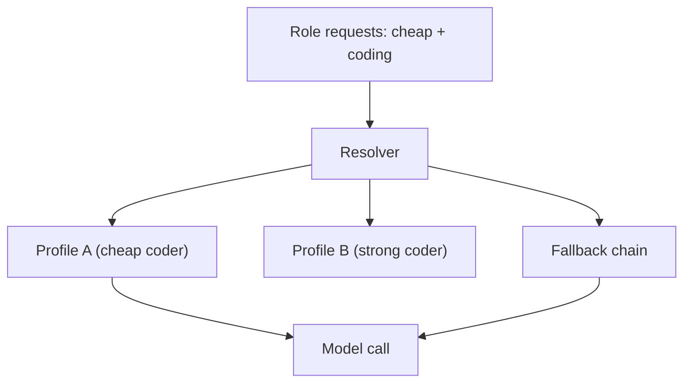

# ModelProfiles Diagrams

## Resolution



```text
request capability -> resolver -> best match -> call
primary fails -> fallback chain -> call
```

## Capability Tags

```text
coding, reasoning, planning, writing,
vision, fast, cheap, offline
```

# Related Documents

- [[ModelProfiles-Part01]]
- [[CostOptimization-Part03]]
