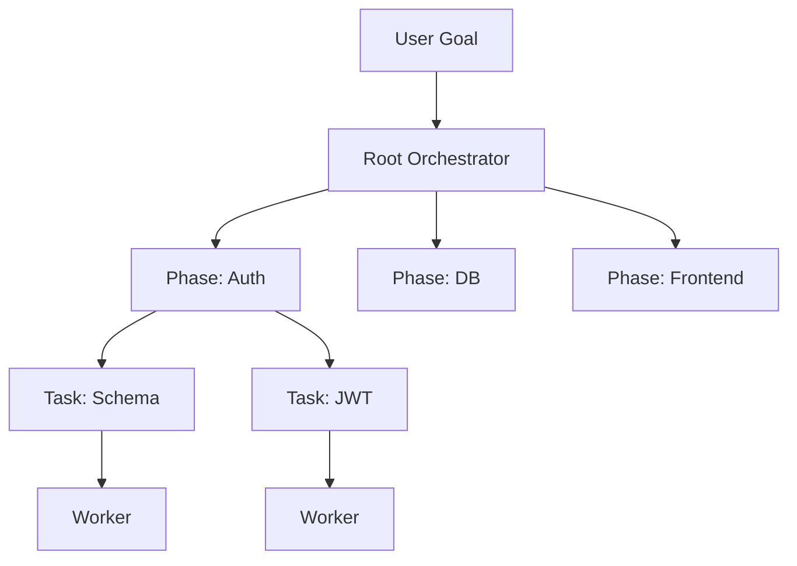

# Planning Diagrams

## Decomposition



```text
Goal
 -> Root
    -> Phase Auth
       -> Task Schema -> Worker
       -> Task JWT    -> Worker
```

## Dynamic Growth

```text
Worker discovers subtask
  -> requests sub-worker
  -> plan node added
  -> graph grows
```

# Related Documents

- [[Planning-Part01]]
- [[AIArchitecture-Part02]]
