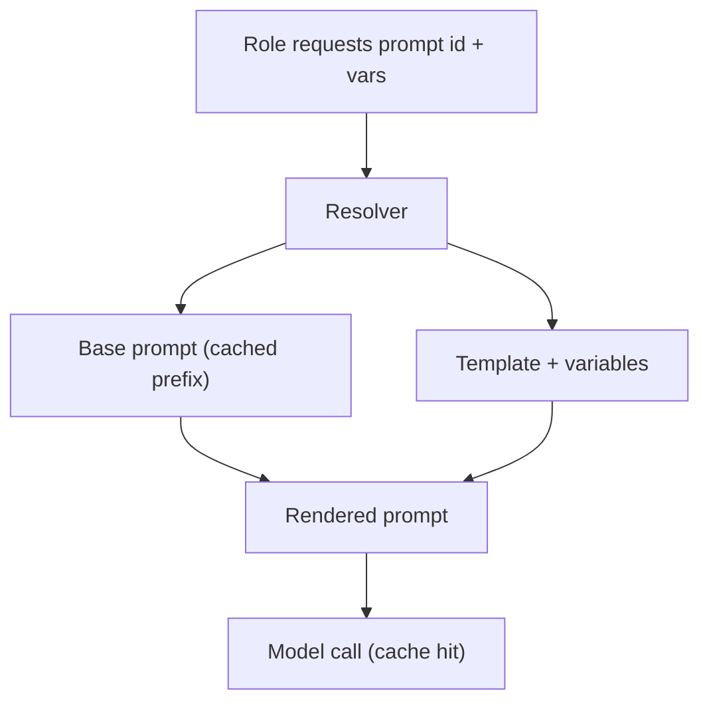

# PromptOptimization Diagrams

## Prompt Resolution



```text
role -> resolver -> base + template(vars) -> rendered prompt -> call
```

## Versioning

```text
prompt:v1  (used by run A)
prompt:v2  (used by run B, replayable)
```

# Related Documents

- [[PromptOptimization-Part01]]
- [[CostOptimization-Part02]]
