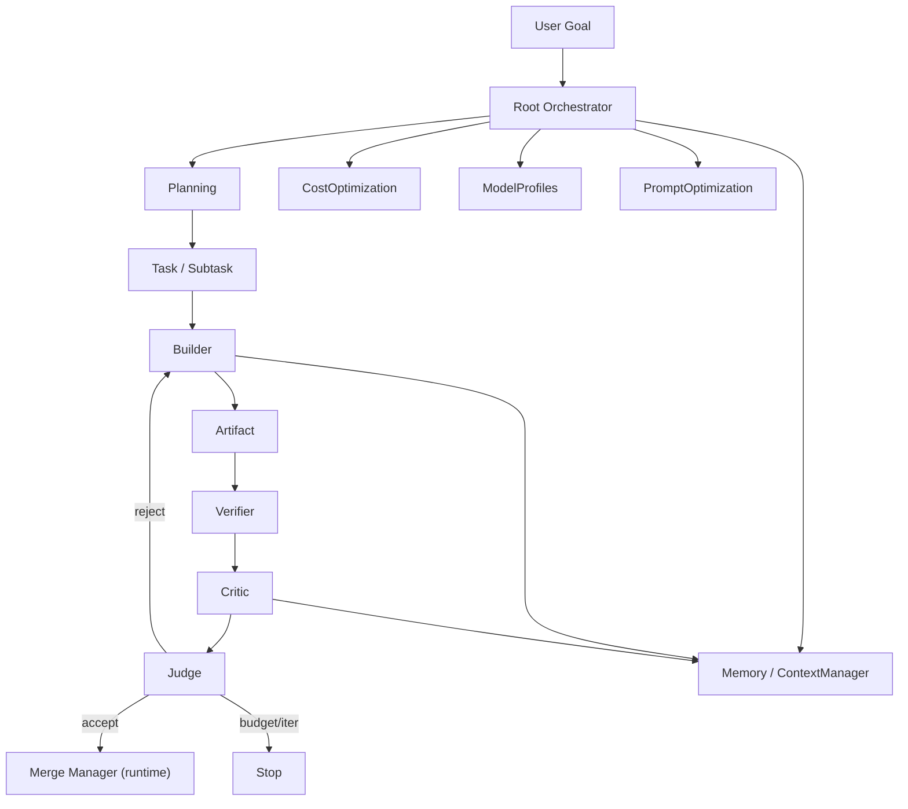

---
title: 10 AI System
status: draft
version: 1.0
tags:
  - ai-system
  - refinement-loop
  - architecture
  - Eulinx
  - flow:P05-SCH-ALLOC
  - flow:P05-SCH-RATELIMIT
  - flow:P06-SPAWN-RESERVE
  - flow:P11-PROV-MANAGER
  - flow:P11-PROV-CLAUDE
  - flow:P11-PROV-OPENAI
  - flow:P11-PROV-GEMINI
  - flow:P11-PROV-OLLAMA
  - flow:P11-PROV-HERMES
  - flow:P11-PROV-OPENROUTER
  - flow:P11-PROV-LMSTUDIO
  - flow:P11-PROV-CUSTOM
  - flow:P11-PROV-REGISTRY
  - flow:P12-PROMPT-MANAGER
  - flow:P12-PROMPT-TEMPLATES
  - flow:P12-PROMPT-PROFILES
  - flow:P12-PROMPT-VARS
  - flow:P12-PROMPT-BUILDER
  - flow:P12-PROMPT-CACHE
  - flow:P12-PROMPT-VALIDATE
  - flow:P12-PROMPT-VERSION
  - flow:P12-PROMPT-OPT
  - flow:P15-ORCH-PLANNER
  - flow:P15-ORCH-ARCHITECT
  - flow:P15-ORCH-RESEARCHER
  - flow:P15-ORCH-PROGRAMMER
  - flow:P15-ORCH-REVIEWER
  - flow:P15-ORCH-DEBUGGER
  - flow:P15-ORCH-DOCS
  - flow:P15-ORCH-QA
  - flow:P15-ORCH-RELEASE
  - flow:P15-ORCH-COORD
  - flow:P17-CLI-PROVIDER
  - flow:P17-CLI-PROMPT
  - flow:P18-UI-PROMPTINSPECT
  - flow:P18-UI-COSTDASH
  - flow:P19-OBS-ANALYTICS
  - flow:P19-OBS-USAGE
  - flow:P19-OBS-COST
related:
  - "[[AIArchitecture-Part01]]"
  - "[[RefinementLoop-Part01]]"
  - "[[Planning-Part01]]"
  - "[[Critic-Part01]]"
  - "[[Judge-Part01]]"
  - "[[Builder-Part01]]"
  - "[[Verifier-Part01]]"
  - "[[CostOptimization-Part01]]"
  - "[[ModelProfiles-Part01]]"
  - "[[PromptOptimization-Part01]]"
---

# 10 AI System

## Purpose

The `10-ai-system` folder defines how Eulinx's artificial intelligence actually thinks, plans, critiques, verifies, and improves its own output.

While `02-runtime` defines the deterministic operating layer (scheduler, locks, merges, events) and `01-core-concepts` defines the nouns (Worker, Task, Artifact, Orchestrator), this folder defines the *reasoning layer* that runs on top of them.

Eulinx is built around a cheap coding model (DeepSeek V4 Flash). That single fact shapes this entire section: the AI system MUST be designed so that a low-cost model can produce good results through structure, iteration, and deterministic verification rather than through raw model intelligence.

The signature idea — the Refinement Loop — is the heart of this section. It lets a base or low-intelligence model turn a rough first draft into a refined, higher-quality artifact by iterating through `Builder`, `Verifier`, `Critic`, and `Judge` roles until a stopping rule is satisfied.

In simple terms:

```text
Cheap model + iteration + verification = flagship-adjacent quality
```

This section also covers how tasks are planned and decomposed, how output is critiqued, how pass/fail is adjudicated, how tokens and cost are tracked, how models are profiled and routed, and how prompts are cached and optimized.

## 10 AI System Folder Structure

```text
10-ai-system/
  README.md

  AIArchitecture/
    AIArchitecture-Part01.md ... AIArchitecture-Part08.md
    AIArchitecture-Diagrams.md

  RefinementLoop/
    RefinementLoop-Part01.md ... RefinementLoop-Part07.md
    RefinementLoop-Diagrams.md

  Planning/
    Planning-Part01.md ... Planning-Part05.md
    Planning-Diagrams.md

  Critic/
    Critic-Part01.md ... Critic-Part04.md
    Critic-Diagrams.md

  Judge/
    Judge-Part01.md ... Judge-Part04.md
    Judge-Diagrams.md

  Builder/
    Builder-Part01.md ... Builder-Part04.md
    Builder-Diagrams.md

  Verifier/
    Verifier-Part01.md ... Verifier-Part04.md
    Verifier-Diagrams.md

  CostOptimization/
    CostOptimization-Part01.md ... CostOptimization-Part05.md
    CostOptimization-Diagrams.md

  ModelProfiles/
    ModelProfiles-Part01.md ... ModelProfiles-Part04.md
    ModelProfiles-Diagrams.md

  PromptOptimization/
    PromptOptimization-Part01.md ... PromptOptimization-Part04.md
    PromptOptimization-Diagrams.md
```

## Total AI System Specification Size

```text
11 AI-system topic folders
1 root README
53 specification parts
11 diagram files
65 Markdown files in total
```

This is expected to grow as implementation reveals deeper needs in routing, caching, and multi-model orchestration.

## Topic Responsibilities

### AIArchitecture

The overall AI subsystem architecture: how Orchestrators, Workers, the four refinement roles, runtime services, memory, and providers fit together. Defines the boundary between the AI reasoning layer and the deterministic runtime.

Parts: 8

### RefinementLoop

The Builder → Verifier → Critic → Judge loop that iteratively upgrades a draft. Defines modes (Low / Medium / High / Ultra), stopping rules, budget enforcement, and pass counting.

Parts: 7

### Planning

Task and goal planning: goal decomposition, checklist generation, phase and task orchestration, dependency modeling, and replanning.

Parts: 5

### Critic

The critique role: a pass that reviews an artifact and produces structured, actionable feedback for the refinment loop to consume.

Parts: 4

### Judge

The adjudication role: a pass that decides accept versus reject, compares candidate artifacts, and enforces the stopping rule. Its verdict is authoritative for loop termination (subject to budget).

Parts: 4

### Builder

The artifact-producing AI worker: turns intent, context, and feedback into concrete artifacts (code, markdown, JSON, plans, patches) without mutating the project directly.

Parts: 4

### Verifier

The artifact-checking AI/runtime worker: runs objective checks (build, lint, tests, type-check) and optionally heuristic semantic checks, producing a verification report.

Parts: 4

### CostOptimization

Token and cost tracking, budget enforcement, model routing and fallback, and cost-aware decisions across the AI subsystem.

Parts: 5

### ModelProfiles

Provider and model capability profiles: capability tags (coding, reasoning, planning, vision, cheap, fast, offline), routing rules, fallback chains, and latency/cost metadata.

Parts: 4

### PromptOptimization

Prompt caching, versioning, templating, inheritance, variable resolution, and prompt-library management to reduce token cost and improve consistency.

Parts: 4

## Global AI System Principles

The AI system MUST treat the Refinement Loop as the primary quality mechanism, not raw model intelligence.

The AI system MUST separate reasoning (AI) from authorization and execution (runtime). AI output MUST NOT directly mutate trusted project state.

The AI system MUST prefer Artifacts over side-effecting actions. Builders produce artifacts; the runtime merges them.

The AI system MUST respect a token/cost budget on every run. The Refinement Loop MUST stop when the budget is exhausted.

The AI system MUST use a stopping rule (judge verdict or max iterations) so loops terminate predictably.

The AI system MUST label LLM-judge and critic output as "suggested," never as ground truth. Objective verification (build/lint/test) is authoritative.

The AI system SHOULD route cheaper models to draft and bulk work, and reserve stronger models for critic/judge when configured.

The AI system MUST keep prompts versioned, cached, and centralized so cheap models receive consistent, well-structured instructions.

The AI system MUST treat workspace isolation as a hard boundary; one project's AI context MUST NOT leak into another.

The AI system MUST degrade gracefully: if a model is unavailable, fall back along the configured chain before failing the task.

## AI System Architecture Overview



## ASCII Overview

```text
User Goal
   |
   v
Root Orchestrator
   |
   +-- Planning (decompose goal -> tasks)
   |
   +-- Refinement Loop per artifact
   |      Builder -> Artifact
   |      Verifier -> checks
   |      Critic  -> feedback
   |      Judge   -> accept / reject / stop
   |
   +-- CostOptimization (budget, tracking)
   +-- ModelProfiles (routing, fallback)
   +-- PromptOptimization (cache, version)
   |
   v
Merge Manager (deterministic runtime)
   |
   v
Project Workspace
```

## AI Notes

Do not assume the model is smart. The architecture MUST carry the intelligence: structure, iteration, and verification do the work that a flagship model would otherwise do in one shot.

Do not let an AI role call `invoke` or write files directly. Builders produce artifacts; the runtime applies them under locks.

Do not treat critic or judge output as truth. They are heuristics that guide termination and routing, not validators of correctness.

Do not exceed the token budget. Cost control is a correctness requirement, not an optional optimization.

Do not hardcode model names into roles. Route by capability profile so users can swap providers freely.

## Related Documents

- [[AIArchitecture-Part01]]
- [[RefinementLoop-Part01]]
- [[Planning-Part01]]
- [[Critic-Part01]]
- [[Judge-Part01]]
- [[Builder-Part01]]
- [[Verifier-Part01]]
- [[CostOptimization-Part01]]
- [[ModelProfiles-Part01]]
- [[PromptOptimization-Part01]]
- [[02-runtime/README]]
- [[04-memory/README]]
- [[01-core-concepts/README]]
