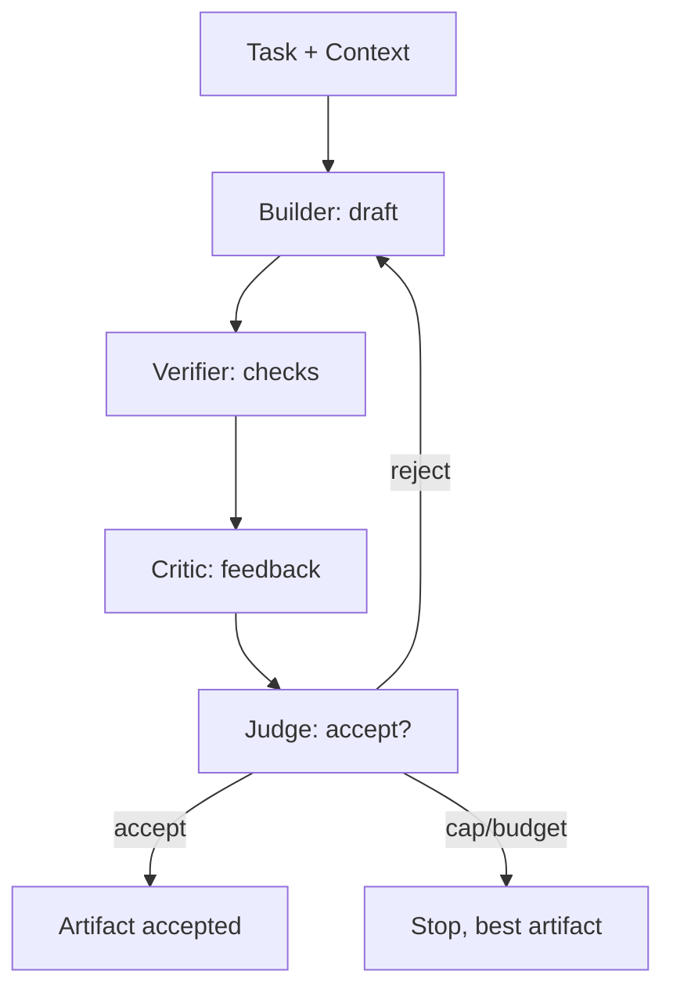
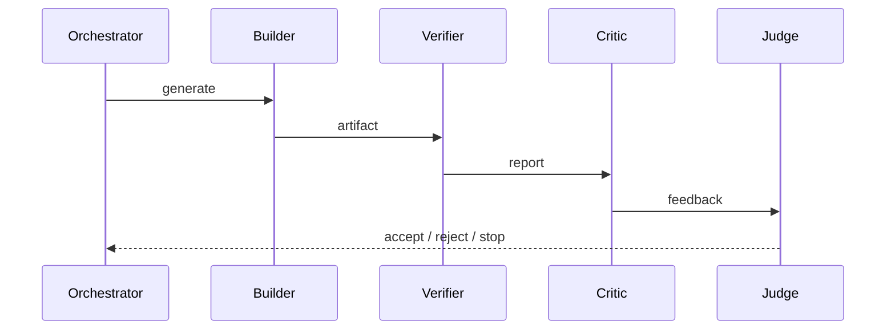

# RefinementLoop Diagrams

## Loop Flow



```text
Task -> Builder -> Verifier -> Critic -> Judge
              ^                    |
              |      reject         |
              +--------------------+
```

## Mode to Cap

```text
Low    -> 1 pass
Medium -> 2 passes
High   -> 4 passes
Ultra  -> 8 passes + strong critic
```

## Sequence



# Related Documents

- [[RefinementLoop-Part01]]
- [[AIArchitecture-Part03]]
