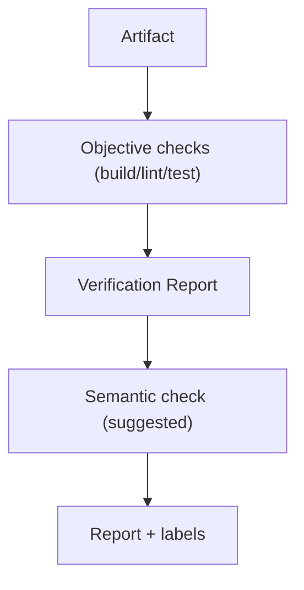

# Verifier Diagrams

## Verification Flow



```text
Artifact -> objective checks -> report -> (optional semantic, suggested)
```

## Hard Gate

```text
required check fails -> Builder must fix -> loop continues
required check passes -> Judge may accept
```

# Related Documents

- [[Verifier-Part01]]
- [[RefinementLoop-Part03]]
- [[Judge-Part02]]
