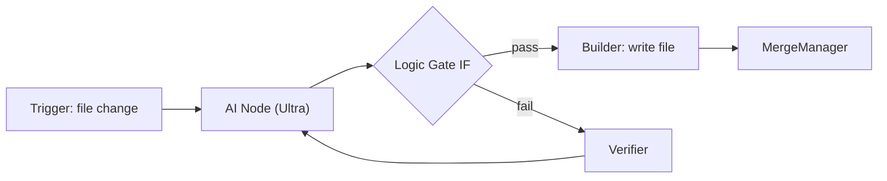

# Automations Diagrams


```mermaid
flowchart LR
  TR["Trigger: file change"] --> AI["AI Node (Ultra)"]
  AI --> G{"Logic Gate IF"}
  G -->|pass| B["Builder: write file"]
  G -->|fail| V["Verifier"]
  V --> AI
  B --> M["MergeManager"]
```

```text
trigger
  -> AI node (refine)
  -> gate (control flow)
  -> builder / verifier loop
  -> merge
```

# Related Documents

- [[Automations-Part01]]
