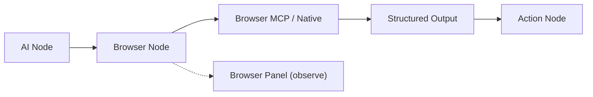

# Browser Diagrams


```mermaid
flowchart LR
  AI["AI Node"] --> B["Browser Node"]
  B --> MCP["Browser MCP / Native"]
  MCP --> OUT["Structured Output"]
  OUT --> ACT["Action Node"]
  B -.-> PANEL["Browser Panel (observe)"]
```

```text
agent -> browser node -> mcp/native -> structured output -> downstream
```

# Related Documents

- [[Browser-Part01]]
