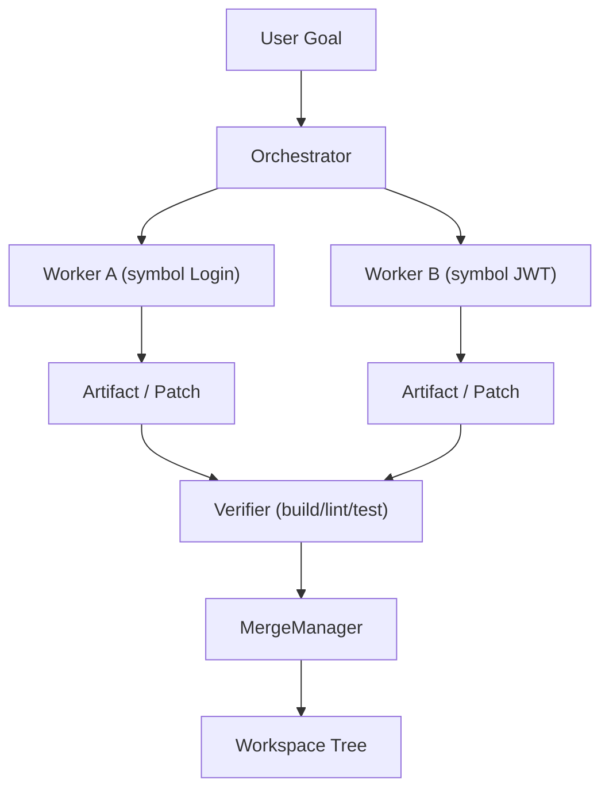

# Coding Diagrams



```text
goal
  -> orchestrator spawns workers
  -> each edits a sandbox (symbol-locked)
  -> artifact/patch
  -> verifier
  -> merge
  -> workspace
```

# Related Documents

- [[Coding-Part01]]
