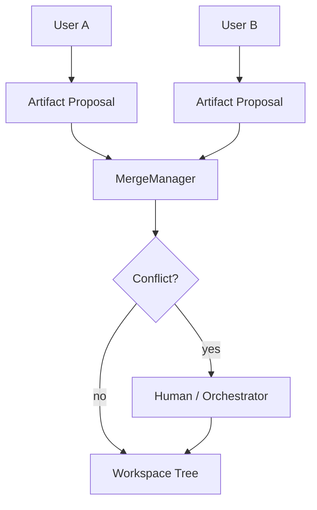

# Collaboration Diagrams


```mermaid
flowchart TD
  U1["User A"] --> A1["Artifact Proposal"]
  U2["User B"] --> A2["Artifact Proposal"]
  A1 --> MM["MergeManager"]
  A2 --> MM
  MM --> C{"Conflict?"}
  C -->|no| WS["Workspace Tree"]
  C -->|yes| H["Human / Orchestrator"]
  H --> WS
```

```text
participants -> artifact proposals -> merge manager -> (conflict -> human) -> tree
```

# Related Documents

- [[Collaboration-Part01]]
