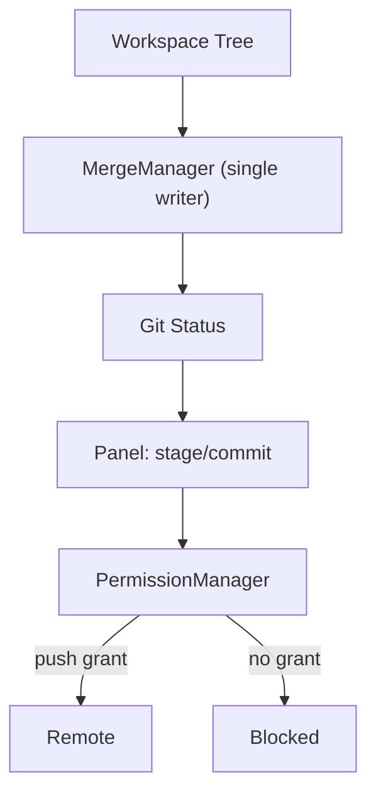

# Git Diagrams


```mermaid
flowchart TD
  WS["Workspace Tree"] --> M["MergeManager (single writer)"]
  M --> G["Git Status"]
  G --> P["Panel: stage/commit"]
  P --> PM["PermissionManager"]
  PM -->|push grant| R["Remote"]
  PM -->|no grant| BLOCK["Blocked"]
```

```text
merge -> git status -> panel -> permission -> push/pull
```

# Related Documents

- [[Git-Part01]]
