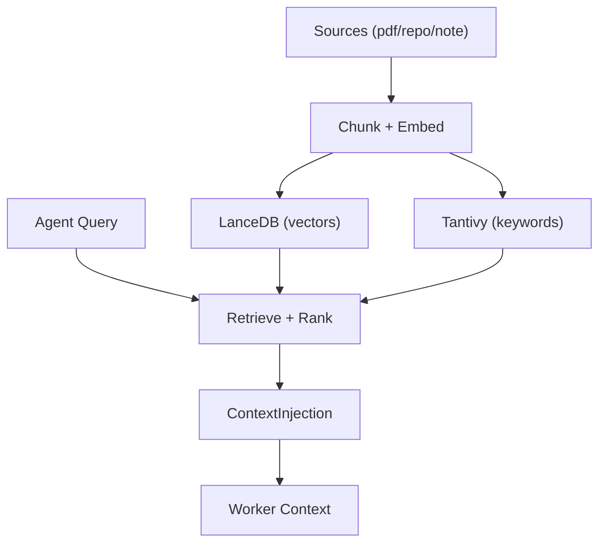

# KnowledgeBase Diagrams


```mermaid
flowchart TD
  S["Sources (pdf/repo/note)"] --> C["Chunk + Embed"]
  C --> V["LanceDB (vectors)"]
  C --> T["Tantivy (keywords)"]
  Q["Agent Query"] --> R["Retrieve + Rank"]
  V --> R
  T --> R
  R --> I["ContextInjection"]
  I --> W["Worker Context"]
```

```text
ingest -> chunk -> embed -> vector + keyword
query -> retrieve -> inject -> worker
```

# Related Documents

- [[KnowledgeBase-Part01]]
