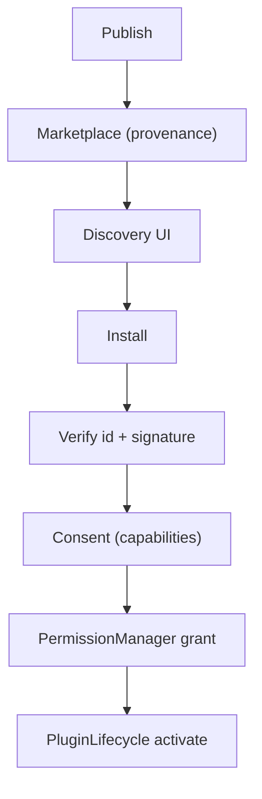

# Marketplace Diagrams


```mermaid
flowchart TD
  D["Discovery UI"] --> I["Install"]
  I --> V["Verify id + signature"]
  V --> C["Consent (capabilities)"]
  C --> PM["PermissionManager grant"]
  PM --> LC["PluginLifecycle activate"]
  P["Publish"] --> M["Marketplace (provenance)"]
  M --> D
```

```text
discover -> verify -> consent -> grant -> activate
publish -> marketplace -> discover
```

# Related Documents

- [[Marketplace-Part01]]
