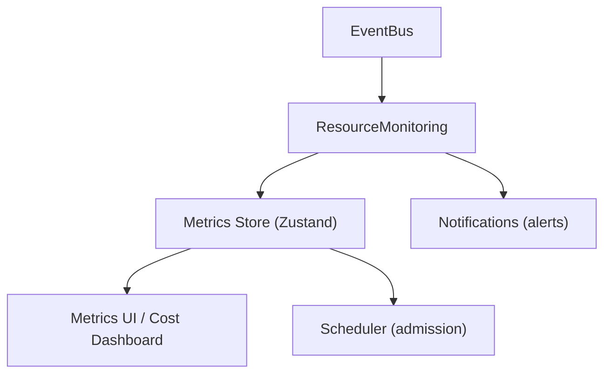

# Metrics Diagrams


```mermaid
flowchart TD
  EB["EventBus"] --> RM["ResourceMonitoring"]
  RM --> STORE["Metrics Store (Zustand)"]
  STORE --> UI["Metrics UI / Cost Dashboard"]
  STORE --> SCHED["Scheduler (admission)"]
  RM --> NOT["Notifications (alerts)"]
```

```text
events -> resource monitoring -> metrics store -> ui + scheduler + notifications
```

# Related Documents

- [[Metrics-Part01]]
