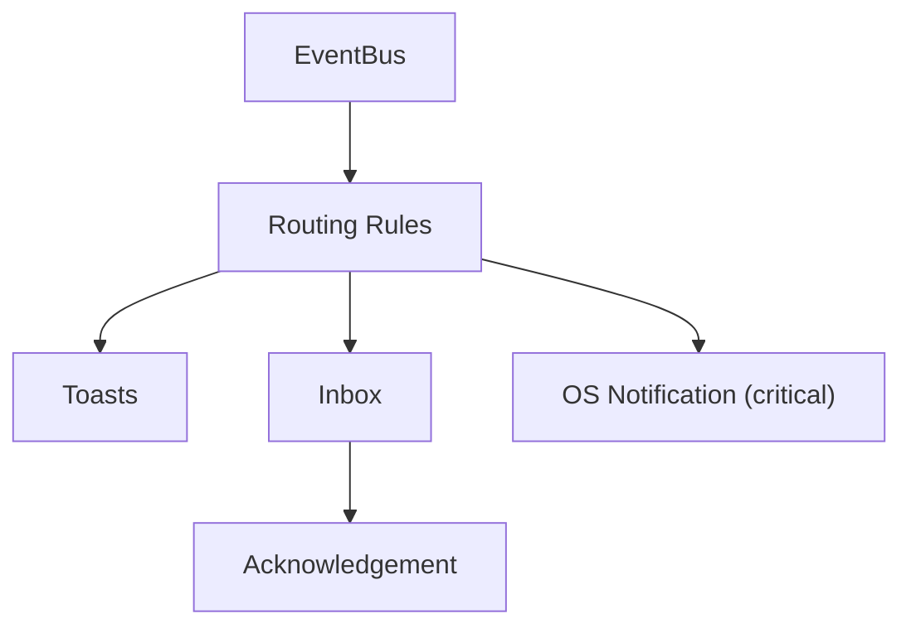

# Notifications Diagrams


```mermaid
flowchart TD
  EB["EventBus"] --> R["Routing Rules"]
  R --> T["Toasts"]
  R --> I["Inbox"]
  R --> O["OS Notification (critical)"]
  I --> ACK["Acknowledgement"]
```

```text
events -> routing -> toast / inbox / os
acknowledge critical
```

# Related Documents

- [[Notifications-Part01]]
