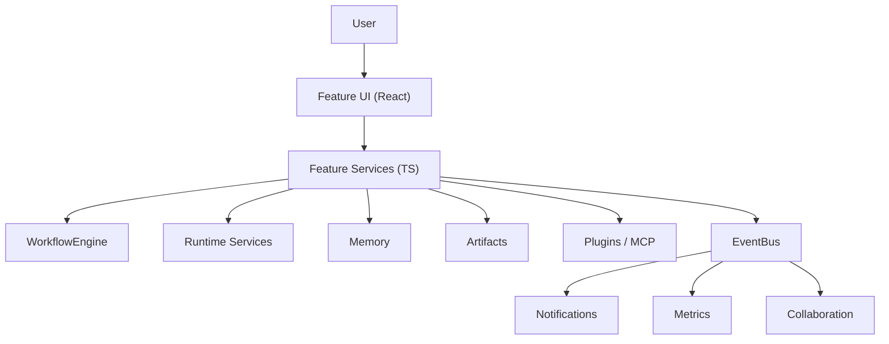

---
title: 11 Features
status: draft
version: 1.0
tags:
  - features
  - coding
  - tasks
  - automations
  - Eulinx
related:
  - "[[Coding-Part01]]"
  - "[[Tasks-Part01]]"
  - "[[Automations-Part01]]"
  - "[[Templates-Part01]]"
  - "[[Browser-Part01]]"
  - "[[Git-Part01]]"
  - "[[Marketplace-Part01]]"
  - "[[Notifications-Part01]]"
  - "[[KnowledgeBase-Part01]]"
  - "[[Metrics-Part01]]"
  - "[[Collaboration-Part01]]"
  - "[[04-memory/README]]"
  - "[[06-workflow-engine/README]]"
  - "[[09-plugin-system/README]]"
---

# 11 Features

## Purpose

The `11-features` folder specifies the user-facing product capabilities that sit on top of the core engines (Workspace, Agent, Workflow, Runtime, UI) and the supporting systems (Memory, Artifacts, Plugins, Resource Manager).

A feature is a capability the user can see, invoke, and reason about: writing and editing code, capturing and executing tasks, building automations, importing templates, browsing the web, using git, installing marketplace extensions, receiving notifications, building a personal knowledge base, watching cost and usage metrics, and collaborating with other users or agents.

Features MUST NOT re-implement engine logic. A feature is a thin composition layer that wires existing engines, runtime services, memory, artifacts, and plugins into a coherent user experience. The feature spec says what the capability IS, what it OWNS, what it MUST / MUST NOT do, and how it delegates to lower layers.

## 11-features Folder Structure

```text
11-features/
  README.md
  Coding/
    Coding-Part01.md ... Coding-Part05.md
    Coding-Diagrams.md
  Tasks/
    Tasks-Part01.md ... Tasks-Part05.md
    Tasks-Diagrams.md
  Automations/
    Automations-Part01.md ... Automations-Part05.md
    Automations-Diagrams.md
  Templates/
    Templates-Part01.md ... Templates-Part04.md
    Templates-Diagrams.md
  Browser/
    Browser-Part01.md ... Browser-Part03.md
    Browser-Diagrams.md
  Git/
    Git-Part01.md ... Git-Part04.md
    Git-Diagrams.md
  Marketplace/
    Marketplace-Part01.md ... Marketplace-Part05.md
    Marketplace-Diagrams.md
  Notifications/
    Notifications-Part01.md ... Notifications-Part03.md
    Notifications-Diagrams.md
  KnowledgeBase/
    KnowledgeBase-Part01.md ... KnowledgeBase-Part04.md
    KnowledgeBase-Diagrams.md
  Metrics/
    Metrics-Part01.md ... Metrics-Part04.md
    Metrics-Diagrams.md
  Collaboration/
    Collaboration-Part01.md ... Collaboration-Part04.md
    Collaboration-Diagrams.md
```

## Total Features Specification Size

```text
12 feature topics
52 specification parts
12 diagram files
1 root README
```

## Topic Responsibilities

### Coding
The AI coding feature: agentic coding loops, multi-file refactors via isolated worker sandboxes, PR/commit automation, inline editing and diff review of artifacts, and refinement applied to code quality.
Parts: 5

### Tasks
The task management feature: natural-language task capture, decomposition into a checklist, assignment to workers, recurring/scheduled tasks, execution with evidence, and progress aggregation up the worker hierarchy.
Parts: 5

### Automations
The workflow/automation running feature: triggers, actions, AI-native nodes, logic gates, scheduled execution, and the reuse of the node graph as a living automation surface.
Parts: 5

### Templates
The reusable workflow and prompt template feature: a gallery of importable templates, template authoring, versioning, parameterization, and publishing to the marketplace.
Parts: 4

### Browser
The built-in browser tool: a capability node (via MCP or native) that lets agents browse the live web, return structured output into the graph, and respect scope and permission boundaries.
Parts: 3

### Git
The git integration feature: a project-scoped git panel (status, stage, commit, push, diff, history), agent-driven git operations under permission control, and PR automation.
Parts: 4

### Marketplace
The plugin/template marketplace feature: discovery, install, update, and publishing of plugins, templates, prompts, and agent teams; trust, provenance, and consent.
Parts: 5

### Notifications
The notification center: a unified event-driven surface for agent, terminal, workflow, git, and resource events, with toasts, a history inbox, and user acknowledgement.
Parts: 3

### KnowledgeBase
The user knowledge base feature: ingestion of docs, PDFs, repos, and notes into a semantic store retrievable by workers, built on VectorMemory and search.
Parts: 4

### Metrics
The cost/usage metrics dashboards: per-run token and cost estimates, budgets, success rates, and execution-time visualization per agent, workflow, and project.
Parts: 4

### Collaboration
The multi-user / multi-agent collaboration feature: shared workspaces over encrypted sync, artifact-based collaboration, shared channels, and team roles (later-phase, Pro).
Parts: 4

## Global Feature Principles

A feature MUST be a composition over existing engines, not a parallel implementation of them.

A feature MUST delegate execution to the Runtime, not run work itself.

A feature MUST scope all activity to the active workspace unless the user explicitly grants broader scope.

A feature MUST NOT bypass the PermissionManager for any authority-bearing action.

A feature SHOULD expose a refinement control wherever output quality is variable.

A feature SHOULD emit events on the EventBus so other features and plugins can react.

A feature MUST render consistent, design-token-driven UI (see [[07-ui-ux/README]]) and MUST NOT embed business logic in components.

A feature SHOULD degrade gracefully when its backing engine (e.g., a model or MCP server) is unavailable.

## Features Architecture Overview



```text
User
  -> Feature UI
  -> Feature Service
  -> (delegates to) Workflow / Runtime / Memory / Artifacts / Plugins
  -> emits Events
  -> Notifications / Metrics / Collaboration consume
```

## AI Notes

Do not implement a feature as a standalone service that duplicates engine behavior; wire the engines together.

Do not let a feature call `invoke()` directly; route through a feature service.

Do not store feature state outside the workspace scope unless it is explicitly global (settings, account, shared templates).

Do not bypass LockManager, MergeManager, or PermissionManager when a feature touches files, git, or external actions.

Do not assume a single agent; features must work under orchestrator-worker fan-out and parallel workers.

Do not hardcode roles (planner, reviewer, coder); let the orchestrator spawn workers dynamically.

## Related Documents

- [[Coding-Part01]]
- [[Tasks-Part01]]
- [[Automations-Part01]]
- [[Templates-Part01]]
- [[Browser-Part01]]
- [[Git-Part01]]
- [[Marketplace-Part01]]
- [[Notifications-Part01]]
- [[KnowledgeBase-Part01]]
- [[Metrics-Part01]]
- [[Collaboration-Part01]]
- [[06-workflow-engine/README]]
- [[09-plugin-system/README]]
- [[04-memory/README]]
