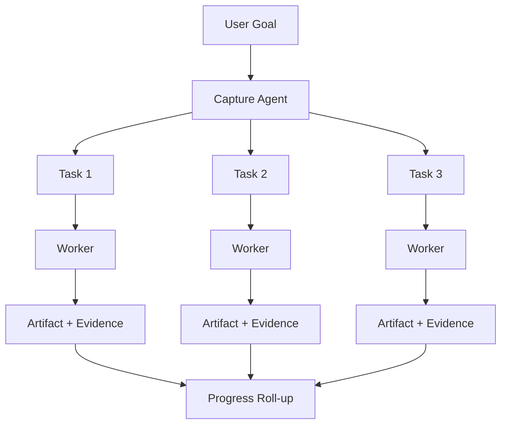

# Tasks Diagrams


```mermaid
flowchart TD
  U["User Goal"] --> C["Capture Agent"]
  C --> T1["Task 1"]
  C --> T2["Task 2"]
  C --> T3["Task 3"]
  T1 --> W1["Worker"]
  T2 --> W2["Worker"]
  T3 --> W3["Worker"]
  W1 --> A1["Artifact + Evidence"]
  W2 --> A2["Artifact + Evidence"]
  W3 --> A3["Artifact + Evidence"]
  A1 --> P["Progress Roll-up"]
  A2 --> P
  A3 --> P
```

```text
goal
  -> decompose (checklist)
  -> assign to workers
  -> execute with evidence
  -> aggregate progress
```

# Related Documents

- [[Tasks-Part01]]
