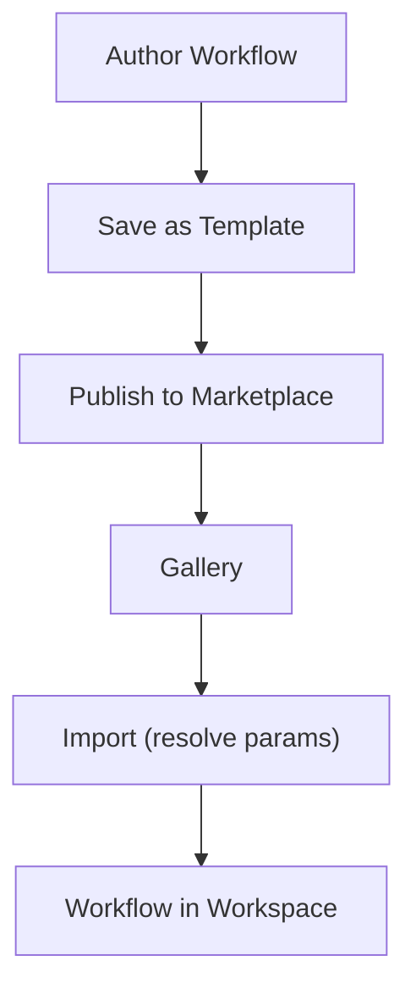

# Templates Diagrams


```mermaid
flowchart TD
  G["Gallery"] --> I["Import (resolve params)"]
  I --> W["Workflow in Workspace"]
  A["Author Workflow"] --> S["Save as Template"]
  S --> P["Publish to Marketplace"]
  P --> G
```

```text
gallery -> import -> workspace workflow
author -> save -> publish -> gallery
```

# Related Documents

- [[Templates-Part01]]
