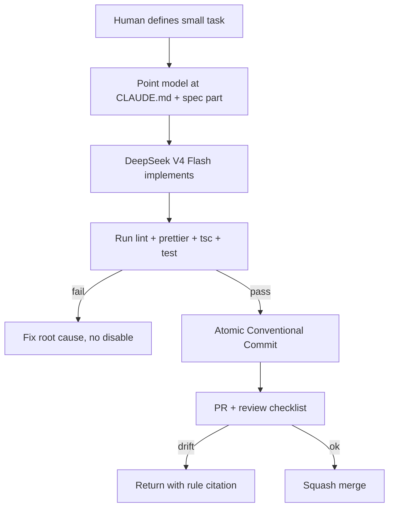

# AIInstructions Diagrams



```text
Task size guidance for cheap model
==================================
BAD : "Build the whole automation system."
GOOD: 1) schema  2) registry  3) canvas  4) connect
       5) stream 6) tests     7) refactor

Forbidden for model
===================
UI -> invoke        (use services/)
hardcoded color     (use tokens)
any in TS           (use unknown + narrow)
grow Rust surface   (thin bridge only)
disable lint to pass (fix root cause)
```

# Related Documents

- [[AIInstructions-Part01]]
- [[ArchitectureRules-Part01]]
