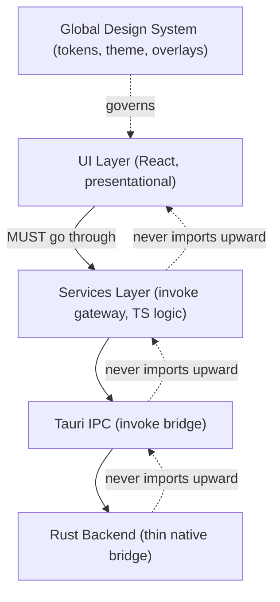

# ArchitectureRules Diagrams



```text
ALLOWED dependency direction (down only)
=========================================
UI  ──▶  Services  ──▶  IPC  ──▶  Rust

FORBIDDEN
=========
UI ──▶ invoke (direct)         [use services]
UI ──▶ business logic          [use services/stores]
feature A ──▶ feature B store  [promote to shared]
circular imports                [forbidden]
Rust ──▶ decides app behavior  [belongs in TS]
```

# Related Documents

- [[ArchitectureRules-Part01]]
- [[FolderStructure-Part04]]
