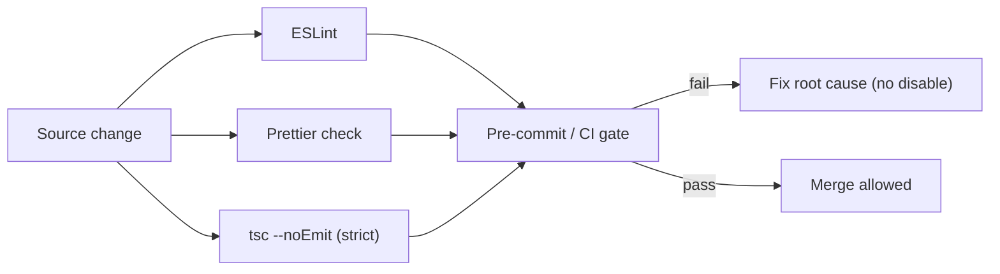

# CodingStandards Diagrams



```text
Enforcement chain
==================
edit ─▶ eslint ─┐
edit ─▶ prettier├─▶ gate ─▶ pass? merge : fix
edit ─▶ tsc     ─┘

Rust side
=========
edit ─▶ cargo fmt ─▶ cargo clippy ─▶ cargo check
(all in src-tauri, minimal surface)
```

# Layer Ownership (text)

```text
UI layer      : presentational only, Tailwind + tokens, no invoke
Services layer: ONLY invoke gateway, typed DTOs
Rust layer    : thin bridge, typed serde commands, no business logic
```

# Related Documents

- [[CodingStandards-Part01]]
- [[ArchitectureRules-Part01]]
