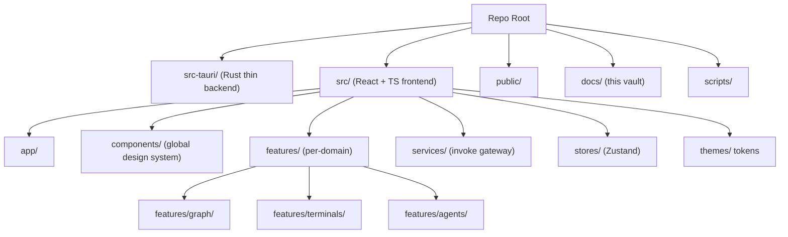

# FolderStructure Diagrams



```text
Repo
├── src-tauri/      Rust: PTY, FS, window, store, dialog
├── src/
│   ├── app/            shell + router + providers
│   ├── components/     GLOBAL design-system wrappers
│   ├── features/       graph/ terminals/ agents/ ... (self-contained)
│   ├── services/       ONLY gateway to invoke()
│   ├── stores/         Zustand client state
│   ├── themes/         tokens (light/dark)
│   ├── hooks/ utils/ types/ constants/ config/
│   └── layouts/ pages/ providers/ contexts/
├── public/  docs/  scripts/
└── configs: package.json vite tsconfig tailwind eslint prettier
```

# Staging Order (text)

```text
1. Init (pnpm + vite + react-ts + git)
2. Tooling (eslint, prettier, strict tsconfig, tailwind, aliases)
3. GLOBAL DESIGN SYSTEM (tokens, theme, fonts, icons, layout, overlay, providers)
4. Tauri shell (thin Rust bridge + capabilities)
5. Services gateway (invoke wrappers)
6. Runtime scaffolding (event bus, stores, query)
7. Features (one at a time, in feature folders)
```

# Related Documents

- [[FolderStructure-Part01]]
- [[ArchitectureRules-Part01]]
