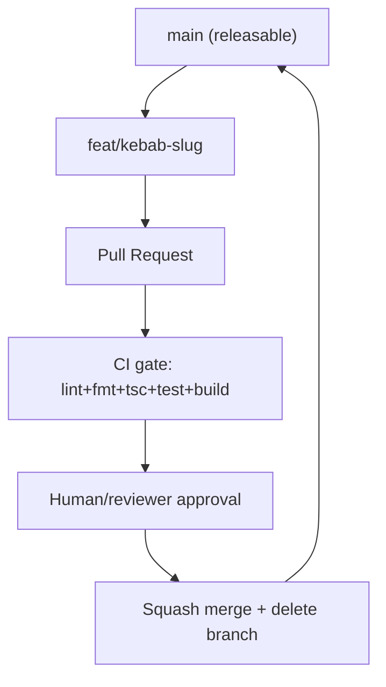

# GitWorkflow Diagrams



```text
Branch & commit flow
====================
main ◀── PR ◀── feat/terminal-pane
                ├── feat(terminals): add split pane      [atomic]
                ├── feat(terminals): wire resize handle  [atomic]
                └── test(terminals): resize behavior     [atomic]

commit subject: type(scope): summary   (<=72 chars)
merge: squash -> linear main, branch deleted
```

# Related Documents

- [[GitWorkflow-Part01]]
- [[TestingRules-Part01]]
