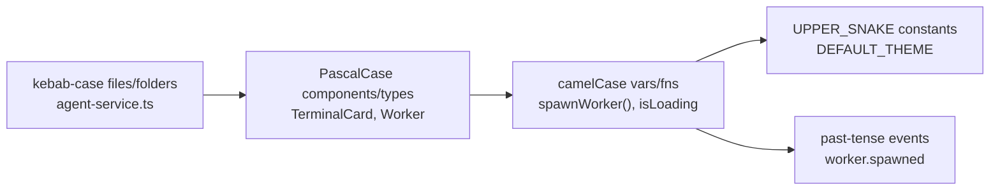

# NamingConvention Diagrams



```text
Naming quick reference
======================
folders/files : kebab-case      (features/, agent-service.ts)
components     : PascalCase     (Button.tsx, TerminalView)
types/interfaces: PascalCase    (Worker, Artifact, RunState)
variables/fns  : camelCase      (activeWorker, getById())
booleans      : is/has/can/should (isLoading, canEdit)
constants     : UPPER_SNAKE     (MAX_CONCURRENT_WORKERS)
events        : past-tense ns   (task.completed, artifact.created)
tests         : same-name.test  (agent-service.test.ts)
```

# Related Documents

- [[NamingConvention-Part01]]
- [[CodingStandards-Part01]]
