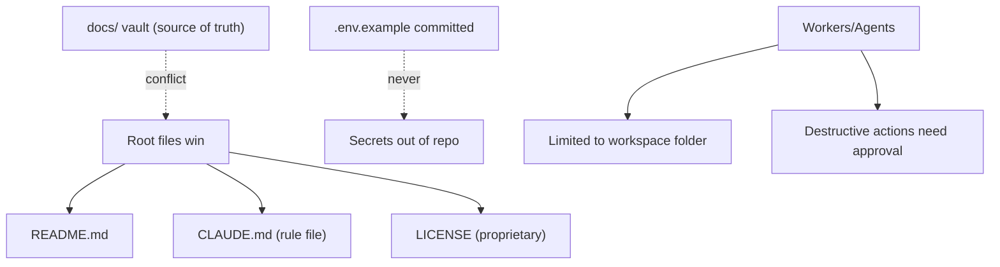

# ProjectRules Diagrams



```text
Governance summary
===================
license     : proprietary, no OSS, no redistribution
root truth  : README + CLAUDE.md + LICENSE (vault defers to these)
secrets     : OS secure store / CI only, never in repo
scope       : workers confined to selected workspace
HITL        : push/delete/publish require approval
contributors: humans AND AI model follow 12-development rules
```

# Related Documents

- [[ProjectRules-Part01]]
- [[AIInstructions-Part01]]
