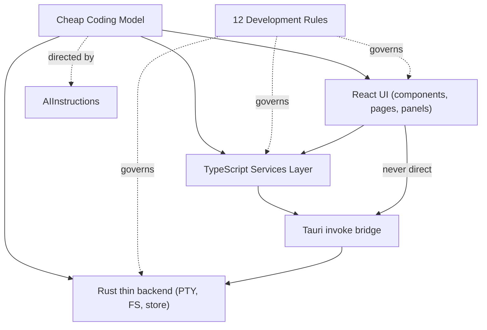

---
title: 12 Development
status: draft
version: 1.0
tags:
  - development
  - conventions
  - engineering
  - Eulinx
  - flow:P00-REPO
  - flow:P00-MONOREPO
  - flow:P00-PKG
  - flow:P00-APP
  - flow:P00-SCRIPTS
  - flow:P00-CONFIGS
  - flow:P01-CORE-UTILS
  - flow:P01-CORE-VALIDATION
  - flow:P01-CORE-ERROR
  - flow:P01-CORE-DI
  - flow:P01-CORE-RESULT
  - flow:P01-CORE-BASE
  - flow:P17-CLI-INIT
  - flow:P17-CLI-UPDATE
  - flow:P20-REL-PACKAGE
  - flow:P20-REL-INSTALL
  - flow:P20-REL-AUTOUPDATE
  - flow:P20-REL-VERSION
  - flow:P20-REL-PIPELINE
related:
  - "[[FolderStructure-Part01]]"
  - "[[CodingStandards-Part01]]"
  - "[[ArchitectureRules-Part01]]"
  - "[[NamingConvention-Part01]]"
  - "[[GitWorkflow-Part01]]"
  - "[[AIInstructions-Part01]]"
  - "[[TestingRules-Part01]]"
  - "[[ReleaseProcess-Part01]]"
  - "[[ProjectRules-Part01]]"
---

# 12 Development

## Purpose

The `12-development` folder defines how Eulinx is built, organized, named, versioned, tested, and released. It is the engineering constitution of the project: every contributor and every AI coding model (notably the cheap DeepSeek V4 Flash model that authors most of Eulinx's code) MUST follow the rules here without exception.

Eulinx is a desktop multi-agent AI automation application. Its stack is Tauri v2 (Rust thin backend) + React 19 + TypeScript + Vite + pnpm + Tailwind + shadcn/ui + Zustand + TanStack Query + React Flow (node graph) + xterm.js (terminals backed by a Rust PTY) + SQLite (SQLx) + LanceDB (vectors) + Tantivy (search). The single most important engineering constraint is that the AI coding model is cheap and that **Rust must stay an extremely thin native bridge** — roughly 95% TypeScript, 5% Rust. Every rule in this section exists to keep the codebase AI-friendly, deterministic, layered, and maintainable.

This folder does not describe features. It describes the *rules of building features*. For product/feature behavior, see [[06-workflow-engine/README]], [[04-memory/README]], and the runtime sections.

## Folder Structure

```text
12-development/
  README.md
  FolderStructure/
    FolderStructure-Part01.md ... Part04.md
    FolderStructure-Diagrams.md
  CodingStandards/
    CodingStandards-Part01.md ... Part04.md
    CodingStandards-Diagrams.md
  ArchitectureRules/
    ArchitectureRules-Part01.md ... Part03.md
    ArchitectureRules-Diagrams.md
  NamingConvention/
    NamingConvention-Part01.md ... Part03.md
    NamingConvention-Diagrams.md
  GitWorkflow/
    GitWorkflow-Part01.md ... Part03.md
    GitWorkflow-Diagrams.md
  AIInstructions/
    AIInstructions-Part01.md ... Part04.md
    AIInstructions-Diagrams.md
  TestingRules/
    TestingRules-Part01.md ... Part03.md
    TestingRules-Diagrams.md
  ReleaseProcess/
    ReleaseProcess-Part01.md ... Part03.md
    ReleaseProcess-Diagrams.md
  ProjectRules/
    ProjectRules-Part01.md ... Part03.md
    ProjectRules-Diagrams.md
```

## Total Development Specification Size

```text
9 development topic folders
31 specification parts
9 diagram files
1 root README
```

## Topic Responsibilities

### FolderStructure
Defines the monorepo / app / package layout, what belongs in each directory, and the rule that the global design system is created before features.
Parts: 4

### CodingStandards
TypeScript, React, and Rust style rules; lint/format/typecheck policy; composition over inheritance; no inline styles; strict types.
Parts: 4

### ArchitectureRules
Layer boundaries (UI → services → Tauri IPC → Rust backend), the prohibition on merged layers, and the global design-system-first mandate.
Parts: 3

### NamingConvention
File, folder, variable, function, type, component, event, and store naming rules; kebab-case vs PascalCase vs camelCase policy.
Parts: 3

### GitWorkflow
Branch strategy, commit message conventions, PR rules, review checklist, and merge policy.
Parts: 3

### AIInstructions
How the cheap coding model is directed: the rule file it must read, task granularity, "small focused tasks" policy, forbidden actions, and the global context pack.
Parts: 4

### TestingRules
Unit / integration / e2e policy, coverage expectations, what MUST be tested, and AI-assisted test authoring rules.
Parts: 3

### ReleaseProcess
Versioning scheme, release pipeline stages, build/sign/distribute flow, and rollback policy.
Parts: 3

### ProjectRules
Overall project governance: licensing (proprietary), `CLAUDE.md`/`README` governance, environment files, and contributor expectations.
Parts: 3

## Global Development Principles

The codebase MUST be optimized for a cheap AI coding model (DeepSeek V4 Flash). Favor small, focused, single-responsibility files over large multi-purpose modules.

TypeScript MUST be the default language for all application logic; Rust MUST stay a thin native bridge (FS, PTY, windows, secure store, dialogs).

The UI layer MUST NOT contain business logic. The services layer MUST be the only place that calls Tauri `invoke`.

All shared design tokens, fonts, icons, layout primitives, and overlay behavior MUST be global and centralized before any feature is built.

No duplicated logic, no hardcoded colors/spacing/radii, no inline styles, no circular dependencies.

Strict TypeScript MUST be enforced; ESLint and Prettier MUST run in CI on every change.

Every cross-layer call MUST be explicit and typed; no `any` in shipped code.

Naming MUST be consistent and self-describing; abbreviations are forbidden unless canonical in the domain.

Git history MUST tell a clean story; every merged PR MUST pass lint, typecheck, and the test gate.

Project governance documents (`README`, `CLAUDE.md`, `LICENSE`) are authoritative and MUST be kept current.

## Development Architecture Overview



```text
Eulinx Build Layers
================

React UI  ──┐
            │  (NO business logic, NO invoke)
            â–¼
Services   ──  TypeScript only, single gateway to backend
            │
            â–¼
Tauri IPC  ──  invoke() bridge
            │
            â–¼
Rust       ──  thin: PTY, FS, windows, secure store, dialogs

Governed by 12-development rules at every layer.
AI model is directed by AIInstructions and constrained by ArchitectureRules.
```

## AI Notes

Do not let the cheap model write large multi-feature files in one pass; break work into small, focused tasks.

Do not let Rust grow beyond the thin-native-bridge mandate; route business logic to TypeScript.

Do not skip the global design system; never hardcode colors, spacing, or fonts inside components.

Do not allow `any`, inline styles, or circular imports in generated code.

Do not merge layers: a component must never call `invoke` directly.

Do not commit without a clean lint + typecheck + test gate.

# Related Documents

- [[FolderStructure-Part01]]
- [[CodingStandards-Part01]]
- [[ArchitectureRules-Part01]]
- [[NamingConvention-Part01]]
- [[GitWorkflow-Part01]]
- [[AIInstructions-Part01]]
- [[TestingRules-Part01]]
- [[ReleaseProcess-Part01]]
- [[ProjectRules-Part01]]
- [[04-memory/README]]
- [[06-workflow-engine/README]]
- [[16-testing/README]]
