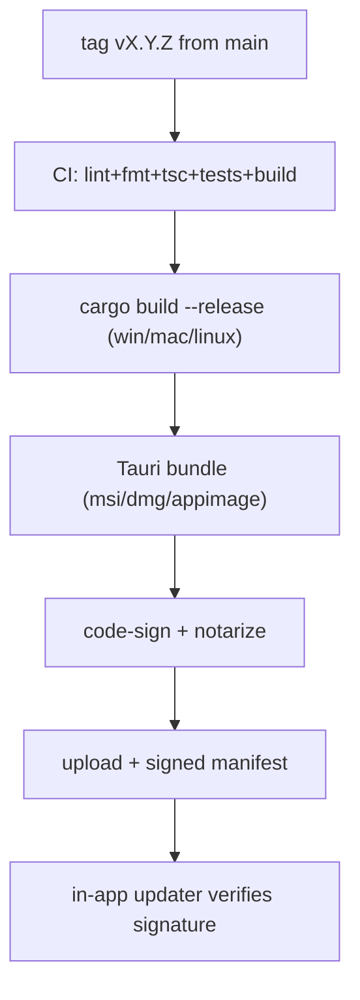

# ReleaseProcess Diagrams



```text
Versioning
==========
MAJOR : breaking UX / data model / graph format
MINOR : backward-compatible feature
PATCH : bug fix / hardening

Rollback
========
bad release -> ship new PATCH (never rewrite tag)
updater    -> verify signature, allow pin/ignore
breaking   -> migration + MAJOR bump
```

# Related Documents

- [[ReleaseProcess-Part01]]
- [[GitWorkflow-Part01]]
