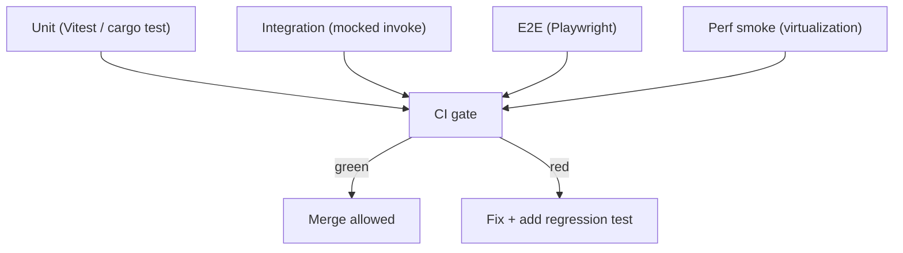

---
title: TestingRules Diagrams
status: draft
version: 1.0
tags: [development, diagrams]
related:
  - "[[TestingRules-Part01]]"
---

# TestingRules Diagrams



```text
Test pyramid for Eulinx
====================
E2E  : few, high-value journeys (workspace -> worker -> stream)
INT  : service+store+mocked invoke, contract parity TS<->Rust
UNIT : utils, stores, services, rust managers (most tests)

Rule: every bug fix ships with a regression test.
Rule: cheap model writes tests per small task, runs suite green.
```

# Related Documents

- [[TestingRules-Part01]]
- [[CodingStandards-Part04]]
