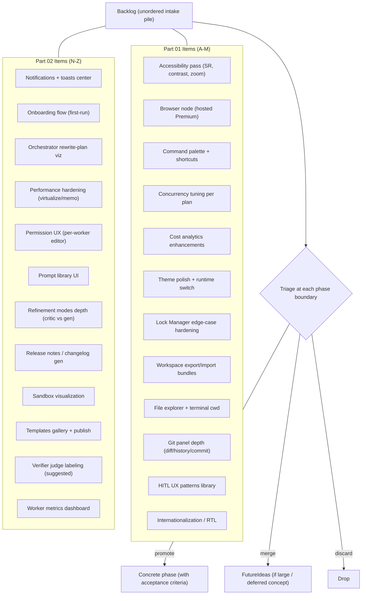

# Backlog Diagrams



```text
BACKLOG — unordered candidate work (refinements, speculative features, small improvements)
          The intake pile. NOT prioritized. Awaits triage.

TRIAGE RULES (at each phase boundary):
  - promote to a phase  -> only when deps shipped + concrete owner/acceptance exist
  - merge into FutureIdeas -> if the item is large (one paragraph max here) or duplicates a FutureIdea
  - discard
  - backlog MAY stay messy; that is its purpose. It is NOT a commitment.

PART 01 (A-M):
  Accessibility pass | Browser node (Premium) | Command palette + shortcuts
  Concurrency tuning per plan | Cost analytics enhancements | Theme polish + runtime switch
  Lock Manager edge-case hardening (symbol locks, deadlock detect)
  Workspace export/import bundles | File explorer + terminal cwd
  Git panel depth (diff/history/commit/push) | HITL UX patterns library
  Internationalization / RTL

PART 02 (N-Z):
  Notifications + toasts center | Onboarding flow | Orchestrator rewrite-plan viz
  Performance hardening (virtualized lists, memo, lazy routes)
  Permission UX (per-worker editor) | Prompt library UI
  Refinement modes depth (cheap generator + strong critic)
  Release notes / changelog gen | Sandbox visualization
  Templates gallery + publish-your-own | Verifier judge labeling ("suggested" not "correct")
  Worker metrics dashboard (tokens/cost/time/success rate)
```

# Related Documents

- [[Backlog-Part01]]
- [[06-workflow-engine/README]]
- [[12-development/README]]
- [[04-memory/README]]
