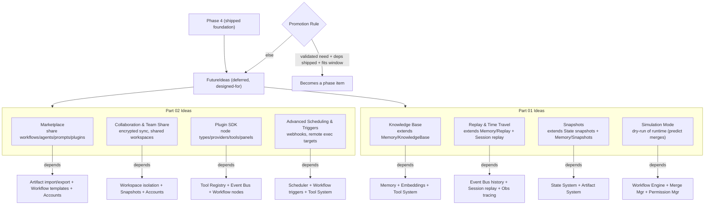

# FutureIdeas Diagrams



```text
FUTUREIDEAS — concepts deferred past Phase 4 but architecturally anticipated (design-for, not bolt-on)

PART 01:
  Knowledge Base      upload docs/PDFs/repos; semantic retrieval (LanceDB + Tantivy)
                      depends: Memory (P2), Embeddings (P2), Tool System (P3)
  Replay & Time Travel record execution; step-by-step debug
                      depends: Event Bus history (P1), Session replay (P2), Obs tracing (P4)
  Snapshots           save/restore full workspace (files+memory+workers+artifacts)
                      depends: State System (P1), Artifact System (P3)
  Simulation Mode     predict what agents WOULD do; no file/ext changes (merge dry-run)
                      depends: Workflow Engine (P4), Merge Mgr (MVP/P1), Permission Mgr (P3)

PART 02:
  Marketplace         share workflows/teams/prompts/plugins/templates (growth engine)
                      depends: Artifact import/export (P3), Workflow templates (P4), Accounts
  Collaboration       encrypted cross-device sync + team workspaces (Pro)
                      depends: Workspace isolation (P3), Snapshots, optional Accounts
  Plugin SDK          full SDK: node types/providers/tools/panels
                      depends: Tool Registry (P3), Event Bus (P1), Workflow nodes (P4)
  Advanced Scheduling remote VM/SSH/K8s targets, webhooks, recurring automations
                      depends: Scheduler (P1), Workflow triggers (P4), Tool System (P3)

PROMOTION RULE: a FutureIdea becomes a phase item only when (1) a concrete user need is
validated, (2) its dependencies are shipped, and (3) it fits the next planning window.
Until then it stays here, NOT in the Backlog churn.
```

# Related Documents

- [[FutureIdeas-Part01]]
- [[06-workflow-engine/README]]
- [[12-development/README]]
- [[04-memory/README]]
