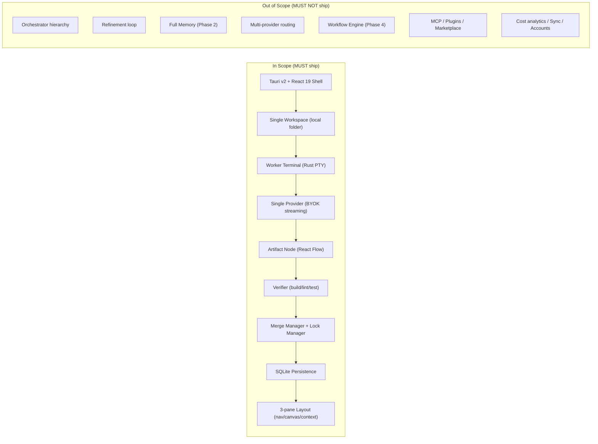

# MVP Diagrams



```text
MVP SCOPE
  IN SCOPE --------------------------------- OUT OF SCOPE
  Tauri+React shell                         no orchestrators (1 worker ok)
  single local Workspace                    no refinement loop
  Worker Terminal (Rust PTY)                no memory beyond SQLite (P2)
  one BYOK provider streaming               no multi-provider routing
  Artifact node on canvas                   no workflow engine (P4)
  Verifier (build/lint/test)                no MCP/plugin/marketplace
  Merge + Lock Manager                      no tool registry beyond FS/term
  SQLite persistence                        no cost analytics / sync / accts
  3-pane layout                             no collab / multi-workspace

CORE LOOP (the thing MVP proves):
  User spawns worker
    -> worker runs AI CLI on task
    -> worker emits Artifact
    -> Verifier checks (pass/fail)
    -> Merge Manager applies (only passing)
    -> Lock Manager serializes same-file edits
    -> Workspace + Canvas + SQLite updated
```

# Related Documents

- [[MVP-Part01]]
- [[06-workflow-engine/README]]
- [[12-development/README]]
- [[04-memory/README]]
