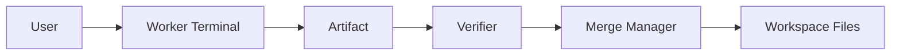

---
title: MVP Specification - Part 01
status: draft
version: 1.0
tags:
  - roadmap
  - mvp
related:
  - "[[13-roadmap/README]]"
  - "[[MVP-Part02]]"
  - "[[MVP-Part03]]"
  - "[[Phase1-Part01]]"
---

# MVP Specification (Part 01)

## Document Index

Part 01 - Definition, Goals, and Core Loop
Part 02 - Scope, Included vs Excluded, and Acceptance
Part 03 - Build Order, Risks, and Completion Criteria

# Purpose

The MVP defines the smallest coherent version of Eulinx that proves the product thesis end to end.

The thesis is: a local-first desktop app where worker terminals dynamically organize into a runtime graph, exchange structured artifacts, and safely merge verified results into a project — under deterministic runtime services.

The MVP is intentionally narrow. It runs on ONE workspace, with ONE model provider, and proves the loop before any orchestration, multi-agent hierarchy, or plugin system exists.

# What "MVP" Means Here

The MVP is not a prototype and not a demo mock. It is the first real, runnable slice of the production architecture described in [[01-core-concepts/README]] and [[02-runtime/README]].

It must:

- launch a Tauri desktop window,
- open a single local project folder as a workspace,
- let the user spawn a worker terminal (Rust PTY) running an AI CLI,
- let that worker produce an artifact (a file or patch),
- run a verifier on the artifact (build/lint/test where applicable),
- merge the artifact into the workspace,
- show the worker and artifact as nodes on a React Flow canvas,
- persist the minimal state to SQLite.

# The Core Loop (the thing the MVP proves)



```text
User spawns worker
  -> worker runs AI CLI on task
  -> worker emits artifact
  -> verifier checks artifact
  -> merge manager applies artifact
  -> workspace updated
  -> node graph reflects state
```

# Goals

Prove the worker-as-terminal mental model from [[03-worker-system/README]].

Prove artifact-based exchange instead of raw transcript passing (see [[05-artifacts/README]]).

Prove the deterministic Merge Manager and Lock Manager keep the workspace safe.

Prove the runtime graph visualizes live work (the observability differentiator).

Prove the thin-Rust, TypeScript-heavy split works for a cheap coding model.

# Why This MVP First

Building orchestrators, workflows, and memory before the core loop works would hide integration bugs behind features. The MVP is the cheapest possible proof that the five-engine architecture (Workspace, Agent/Worker, Workflow, Runtime, UI) holds together.

# Related Documents

- [[MVP-Part02]]
- [[Phase1-Part01]]
- [[03-worker-system/README]]
- [[05-artifacts/README]]
