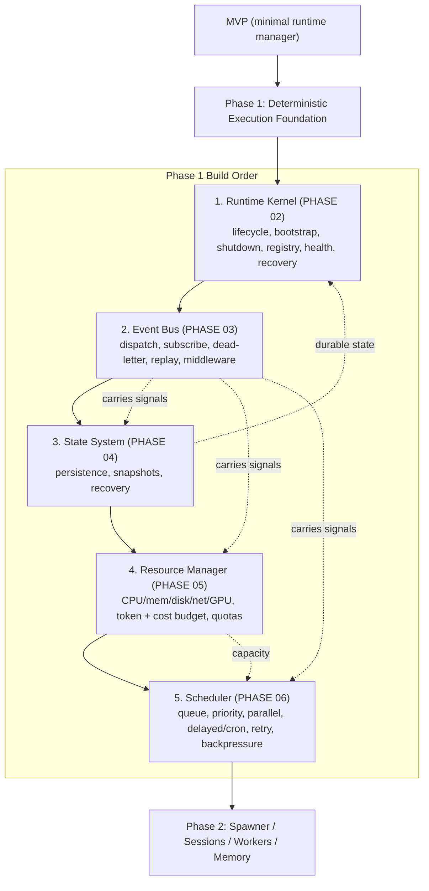

# Phase1 Diagrams



```text
PHASE 1 — REPLACES MVP's minimal runtime manager with the real foundation

Prerequisites: MVP demoable, Foundation (PHASE 01) stable.

DEPENDENCY / BUILD ORDER (strict):
  (1) Runtime Kernel      PHASE 02  -> boots/closes/recovers Rust backend; no LLM
        |
        v
  (2) Event Bus           PHASE 03  -> ONLY cross-subsystem comms path; dead-letter, replay
        |
        v
  (3) State System        PHASE 04  -> runtime/worker/session/workflow/artifact/task state
        |                               snapshots + recovery to SQLite
        v
  (4) Resource Manager    PHASE 05  -> finite capacity: CPU/mem/disk/net/GPU + TOKEN/COST
        |                               budgets, quotas, monitoring
        v
  (5) Scheduler           PHASE 06  -> when work runs: FIFO/priority/parallel/delayed/cron
                                        retry/dead queue, concurrency, backpressure, cancel

WHY BEFORE WORKERS: Worker System (P2) assumes scheduler + state + bus exist.

ACCEPTANCE: every subsystem talks via Event Bus (no direct calls); state persists/restores;
Resource Manager enforces budgets; Scheduler queues/prioritizes/retries/cancels + backpressure.
```

# Related Documents

- [[Phase1-Part01]]
- [[06-workflow-engine/README]]
- [[12-development/README]]
- [[04-memory/README]]
