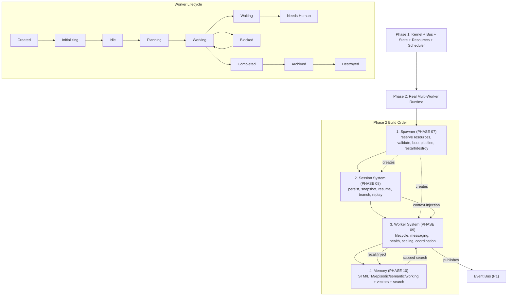

# Phase2 Diagrams



```text
PHASE 2 — consumes the Phase 1 foundation (kernel/bus/state/resources/scheduler)

Prerequisites: Phase 1 complete.

BUILD ORDER (strict):
  (1) Spawner      PHASE 07  -> HOW things are created (Scheduler decides WHEN)
                              reserves resources, validates, boot pipeline, cleanup/restart
                              enables "workers spawn workers" (graph grows dynamically)
        |
        v
  (2) Session System PHASE 08 -> scoped convo/exec context; snapshot, resume, branch, replay
        |                         selective context injection (never full transcript)
        v
  (3) Worker System  PHASE 09 -> lifecycle state machine (see below); channels + artifacts
        |                         health recovery; scaling/pools; coordination w/ isolation
        v
  (4) Memory         PHASE 10 -> STM, LTM, episodic, semantic, working memory
                                embeddings + vector (LanceDB), search (Tantivy)
                                summaries/compression/pruning, policies, manager
                                scoped to workspace; artifact refs > copied content

WORKER LIFECYCLE STATE MACHINE:
  Created -> Initializing -> Idle -> Planning -> Working
  Working -> Waiting / Blocked / Needs Human / Completed
  Completed -> Archived -> Destroyed
  (Blocked/Needs Human can return to Working)

COMMS MODEL: workers publish to channels + pass Artifacts; NO full-transcript passing.

ACCEPTANCE: spawn/restart/destroy w/ cleanup; sessions persist/branch/replay; lifecycle
observable as events; channel+artifact comms; memory scoped/searchable/injectable.
```

# Related Documents

- [[Phase2-Part01]]
- [[06-workflow-engine/README]]
- [[12-development/README]]
- [[04-memory/README]]
