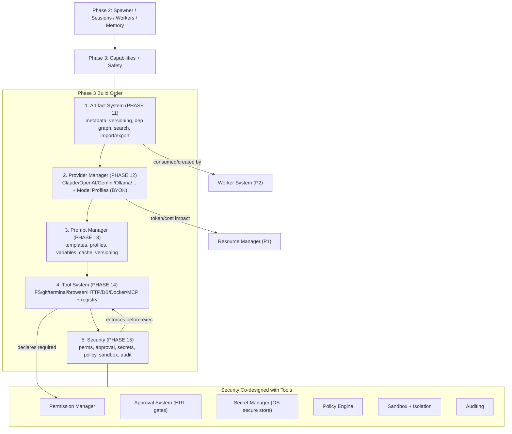

# Phase3 Diagrams



```text
PHASE 3 — gives workers real capabilities and makes them safe

Prerequisites: Phase 2 (Spawner, Sessions, Worker System, Memory).

BUILD ORDER (strict):
  (1) Artifact System PHASE 11 -> formalizes MVP sketch: every output is an Artifact
        |                         (md/code/JSON/prompt/test/screenshot/patch/...); metadata,
        |                         versioning, storage, references, DEPENDENCY GRAPH, search
        v
  (2) Provider Manager PHASE 12 -> multi-model streaming (Claude/OpenAI/Gemini/Ollama/
        |                         Hermes/OpenRouter/LM Studio/custom); Model Profiles map
        |                         role->model (Coding/Reasoning/Planning/...); BYOK in OS store
        v
  (3) Prompt Manager   PHASE 13 -> shared library: templates, profiles, variables,
        |                         context/prompt builder, cache, validation, versioning
        v
  (4) Tool System      PHASE 14 -> capability layer; registered tools (FS/git/terminal/
        |                         browser/HTTP/DB/Docker/MCP); agents get tools not raw caps
        v
  (5) Security         PHASE 15 -> Permission Mgr (per-worker allow/deny), Approval (HITL),
                                Secret Mgr (never logged), Policy Engine, Sandbox/Isolation,
                                Auditing, AuthN/Z. Tools DECLARE perms; PM enforces pre-exec.

ACCEPTANCE: artifacts version/search/import/export + queryable dep graph; multi-provider
streaming w/ profiles + safe keys; prompts versioned/templated; tool registry + perms;
security enforces permissions/approval/isolation/audit/secret safety.
```

# Related Documents

- [[Phase3-Part01]]
- [[06-workflow-engine/README]]
- [[12-development/README]]
- [[04-memory/README]]
