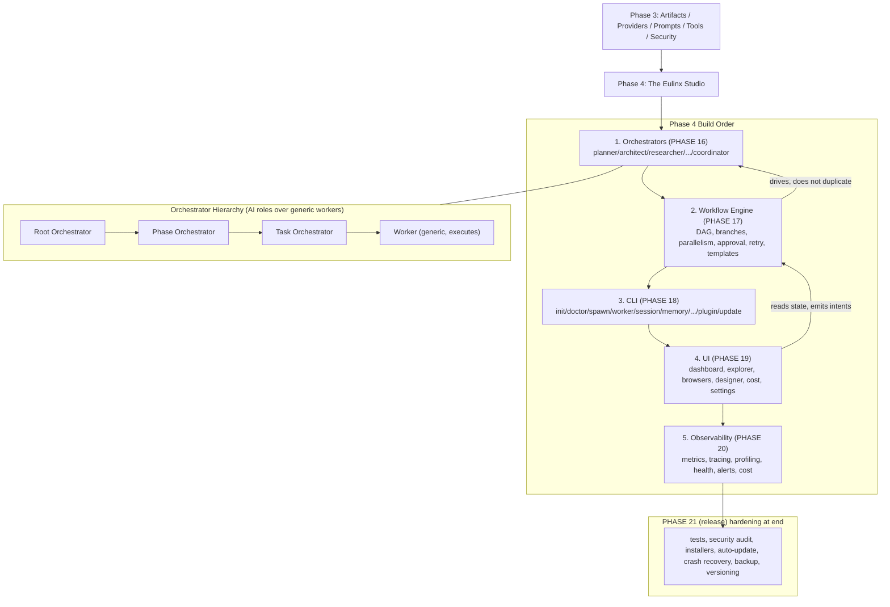

---
title: Phase4 Diagrams
status: draft
version: 1.0
tags: [roadmap, diagrams]
related: ["[[Phase4-Part01]]"]
---

# Phase4 Diagrams



```text
PHASE 4 — turns the engine into a usable local-first desktop studio

Prerequisites: Phase 3 (Artifacts, Providers, Prompts, Tools, Security).

BUILD ORDER (strict):
  (1) Orchestrators   PHASE 16 -> AI planning/coordination layer (LLM). Hierarchy:
        |               Root -> Phase -> Task -> Worker. Plans rewrite at runtime;
        |               progress aggregates upward (worker -> task -> phase -> project).
        |               Layered on generic workers; runtime services stay deterministic/LLM-free.
        v
  (2) Workflow Engine PHASE 17 -> DAG execution: deps, branches, parallelism, human-approval,
        |               retry, resume, checkpoints, templates. Node types: worker/tool/logic-gate/
        |               I/O/builder-verifier/artifact/memory/MCP/human-approval/delay.
        v
  (3) CLI             PHASE 18 -> headless/scriptable: init/doctor/runtime/scheduler/spawn/
        |               worker/session/memory/artifact/provider/workflow/prompt/tool/config/plugin/update
        v
  (4) UI              PHASE 19 -> 3-pane studio: dashboard, runtime monitor, worker/session/
        |               memory/artifact browsers, prompt inspector, workflow designer, logs,
        |               metrics, cost dashboard, settings. NO business logic (reads state only).
        v
  (5) Observability   PHASE 20 -> metrics, tracing, profiling, health, alerts, analytics,
                      usage, cost tracking, performance. Ties artifact journey end-to-end.

END OF PHASE 4: PHASE 21 release hardening (tests, audit, packaging, installers, auto-update,
crash recovery, backup, versioning, release pipeline). Eulinx = visual multi-agent studio.

RISKS: orchestrator token cost (+90%/15x) -> budget guards + refinement slider enforced;
UI logic creep -> "UI has no business logic"; Workflow vs Orchestrator overlap -> keep
Workflow deterministic, orchestrators drive it.
```

# Related Documents

- [[Phase4-Part01]]
- [[06-workflow-engine/README]]
- [[12-development/README]]
- [[04-memory/README]]
