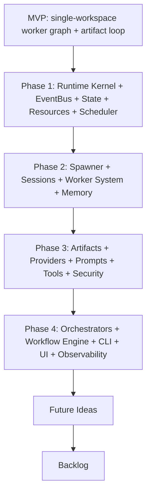

---
title: 13 Roadmap
status: draft
version: 1.0
tags:
  - roadmap
  - architecture
  - Eulinx
related:
  - "[[MVP-Part01]]"
  - "[[Phase1-Part01]]"
  - "[[Phase2-Part01]]"
  - "[[Phase3-Part01]]"
  - "[[Phase4-Part01]]"
  - "[[FutureIdeas-Part01]]"
  - "[[Backlog-Part01]]"
  - "[[12-development/README]]"
  - "[[06-workflow-engine/README]]"
  - "[[04-memory/README]]"
---

# 13 Roadmap

## Purpose

The `13-roadmap` folder is the master build chart for Eulinx.

It defines what ships, in what order, and why. It translates the architecture vault (01-core-concepts, 02-runtime, 03-worker-system, 04-memory, 06-workflow-engine, 12-development) into a dependency-driven delivery plan that a cheap coding model (DeepSeek V4 Flash) can follow one small task at a time.

The roadmap is intentionally split into:

- an MVP definition (the smallest coherent product that proves the core loop),
- four delivery phases (Phase 1 through Phase 4),
- a FutureIdeas capture list (post-Phase-4 concepts),
- an unordered Backlog of candidate work.

Each phase mirrors the Implementation-Flow.md sequence (PHASE 00 to PHASE 21) but groups those low-level phases into shippable product milestones so the team always knows what "done" means next.

## Roadmap Phase → Implementation-Flow Mapping

The roadmap's Phase 1–4 are macro-phases that group the low-level Implementation-Flow phases (PHASE 00–21) into shippable milestones. The exact mapping is:

| Roadmap Phase | Implementation-Flow PHASE range | Low-level phases covered |
| --- | --- | --- |
| MVP | PHASE 00–04 (proves core loop headless) | 00 project init, 01 foundation, 02 runtime kernel, 03 event bus, 04 state system |
| Phase 1 | PHASE 00–06 | 00 project init, 01 foundation, 02 runtime kernel, 03 event bus, 04 state system, 05 resource manager, 06 scheduler |
| Phase 2 | PHASE 07–10 | 07 spawner, 08 session system, 09 worker system, 10 memory |
| Phase 3 | PHASE 11–15 | 11 artifact system, 12 providers, 13 prompts, 14 tool system, 15 security |
| Phase 4 | PHASE 16–21 | 16 orchestrators, 17 workflow engine, 18 CLI, 19 UI, 20 observability, 21 release |

Note: the MVP is a vertical slice drawn from the front of Phase 1 (PHASE 00–04) and does not add new Implementation-Flow phases; Phase 1 as a whole still spans PHASE 00–06.

## Folder Structure

```text
13-roadmap/
  README.md
  MVP/
    MVP-Part01.md
    MVP-Part02.md
    MVP-Part03.md
  Phase1/
    Phase1-Part01.md
    Phase1-Part02.md
    Phase1-Part03.md
  Phase2/
    Phase2-Part01.md
    Phase2-Part02.md
    Phase2-Part03.md
  Phase3/
    Phase3-Part01.md
    Phase3-Part02.md
    Phase3-Part03.md
  Phase4/
    Phase4-Part01.md
    Phase4-Part02.md
    Phase4-Part03.md
  FutureIdeas/
    FutureIdeas-Part01.md
    FutureIdeas-Part02.md
  Backlog/
    Backlog-Part01.md
    Backlog-Part02.md
```

## Total Roadmap Specification Size

```text
7 roadmap topic folders
1 root README
21 specification parts
0 diagram files (diagrams live in the per-part inline mermaid/ascii where useful)
```

## Topic Responsibilities

### MVP
Defines the Minimum Viable Product: the thinnest vertical slice that proves the worker-graph, artifact, and runtime loop on a single local workspace using one provider. Parts: 3

### Phase1
Establishes the runtime kernel, event bus, state system, resource manager, and scheduler so the app has a deterministic execution foundation. Parts: 3

### Phase2
Adds the spawner, session system, worker system, and memory so workers can be created, isolated, tracked, and remembered. Parts: 3

### Phase3
Adds artifacts, providers, prompts, tool system, and security so workers can use real tools and capabilities safely under permission control. Parts: 3

### Phase4
Adds orchestrators, the workflow engine, CLI, UI surfaces, and observability so the product becomes a usable desktop studio. Parts: 3

### FutureIdeas
Captures post-Phase-4 concepts (knowledge base, replay, snapshots, marketplace, simulation mode, collaboration) to be scheduled later. Parts: 2

### Backlog
Unordered candidate work items, refinements, and speculative features awaiting triage into a future phase. Parts: 2

## Global Roadmap Principles

The roadmap MUST respect the dependency order defined in [[12-development/README]] and the Implementation-Flow phases.

A phase MUST NOT begin until its declared prerequisites are complete and tested.

Every task MUST be small and verifiable, with explicit acceptance criteria, so a cheap coding model can implement it in one pass. See [[12-development/README]].

The MVP MUST prove the core loop (worker spawns → produces artifact → verifier → merge → workspace) before any advanced feature is built.

Rust MUST remain a thin bridge; business logic stays in TypeScript. See [[02-runtime/README]].

Every shipped phase MUST keep the Obsidian documentation in sync; roadmap docs reference the architecture sections they realize.

Phases MUST be demoable: at the end of each phase there is a runnable, inspectable state of the app.

## Roadmap Architecture Overview



```text
MVP
  -> Phase 1 (kernel)
  -> Phase 2 (workers + memory)
  -> Phase 3 (capabilities + security)
  -> Phase 4 (orchestration + UI)
  -> Future Ideas
  -> Backlog
```

## AI Notes

Do not implement an entire phase in a single prompt. Break every phase into small, verifiable tasks.

Do not skip dependency phases. The Implementation-Flow ordering exists because later systems assume earlier ones.

Do not build UI before the runtime loop works headless. The MVP proves the engine first.

Do not widen Rust scope. When in doubt, keep the backend thin and push logic to TypeScript.

Do not treat the roadmap as frozen. FutureIdeas and Backlog feed the next planning cycle.

## Related Documents

- [[MVP-Part01]]
- [[Phase1-Part01]]
- [[Phase2-Part01]]
- [[Phase3-Part01]]
- [[Phase4-Part01]]
- [[FutureIdeas-Part01]]
- [[Backlog-Part01]]
- [[12-development/README]]
- [[06-workflow-engine/README]]
- [[04-memory/README]]
- [[16-testing/README]]
