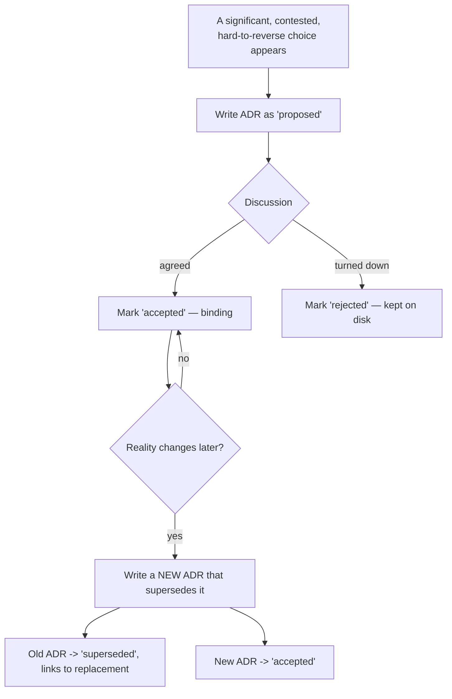

---
title: 14 Architecture Decisions
status: draft
version: 1.0
tags:
  - architecture-decisions
  - adr
  - architecture
  - Eulinx
related:
  - "[[ADR-001]]"
  - "[[00-introduction/README]]"
  - "[[01-core-concepts/README]]"
  - "[[02-runtime/README]]"
---

# 14 Architecture Decisions

## Purpose

The `14-architecture-decisions` folder is the memory of *why* Eulinx is built the way it is.

Every other section of this vault describes *what* a component is and *how* it behaves. This section is the only one that records the *reasoning* behind the choices that produced those components: the forces that were in tension, the option that was chosen, the options that were rejected, and the consequences the team agreed to accept. When a future contributor (human or AI) asks "why is the WorkflowEngine separate from the ExecutionEngine?" or "why can a plugin never touch the filesystem directly?", the answer lives here, dated and attributable, not scattered across implementation notes.

An Architecture Decision Record (ADR) is a short, self-contained document that captures one significant, hard-to-reverse decision at the moment it was made. ADRs are append-only history. A decision is never silently rewritten; when reality changes, a new ADR supersedes an old one, and the old one stays on disk marked `superseded` so the trail of reasoning is never lost. This matters especially for Eulinx, because a cheap coding model (DeepSeek V4 Flash) writes most of the code and needs the *rationale* spelled out, not implied, so it does not "helpfully" undo a load-bearing constraint.

## What An ADR Is

An ADR records a decision that is:

- **Significant** — it shapes structure, cost, security, or the developer experience across more than one section.
- **Hard to reverse** — undoing it later would be expensive or risky.
- **Contested** — there was a real alternative a reasonable engineer might have picked.

Trivial or easily reversible choices (a variable name, a Tailwind spacing value, which icon to use) are *not* ADRs. They live in the relevant section spec. If a choice can be changed in an afternoon without a ripple, it does not belong here.

Each ADR answers five questions in prose:

- **Context** — what problem forced a decision, and what forces were pulling in different directions.
- **Decision** — the single thing that was decided, stated plainly.
- **Consequences** — what becomes easier (positive) and what becomes harder or riskier (negative) as a result.
- **Alternatives considered** — the credible options that were rejected, and why each lost.
- **Related** — wikilinks to the sections of the vault this decision governs.

## The Status Lifecycle

Every ADR carries a `status` in its frontmatter. The lifecycle is deliberately small:

- **proposed** — the decision is written down and under discussion. It is not yet binding. Code MUST NOT depend on a `proposed` ADR as if it were settled.
- **accepted** — the decision is binding. Every section spec and every line of code MUST honor it. This is the normal steady state of an ADR in this vault.
- **superseded** — a later ADR replaced this decision. A `superseded` ADR is never deleted. Its frontmatter names the ADR that replaced it, and the replacing ADR names the one it superseded. The reasoning trail is preserved forever.

Two secondary states may appear as an ADR ages:

- **deprecated** — the decision is discouraged and on its way out, but no single replacement ADR has been written yet.
- **rejected** — a proposal that was considered and explicitly turned down, kept on disk so the same idea is not re-litigated from scratch.

The one rule that governs all of this: an accepted ADR is immutable in its Decision and Context. Only its status and its `related`/superseding links may change. To change the decision itself, you write a new ADR.

## The ADR Template

Every ADR file in this folder follows the same internal shape so a reader (or a model) always knows where to look:

- **YAML frontmatter** — `title`, `status`, `version`, `tags` (including `adr`, `architecture`, `Eulinx`), and `related` wikilinks.
- **Title heading** — `ADR-NNN: <the decision in a few words>`.
- **Status** — the current lifecycle state, and any supersede relationship in words.
- **Context** — the problem and the competing forces.
- **Decision** — what was decided.
- **Consequences** — a positive list and a negative list.
- **Alternatives Considered** — each rejected option and the reason it lost.
- **Related** — wikilinks to governed sections and to neighboring ADRs.

Filenames are `ADR-NNN.md` with a zero-padded three-digit number. Numbers are assigned in order and never reused, even after an ADR is superseded.

## Folder Structure

This section is flat. The README is a single file, and each ADR is a single self-contained file. ADRs are short by design and do not become folders.

```text
14-architecture-decisions/
  README.md

  ADR-001.md   Tauri v2 with a thin Rust backend
  ADR-002.md   React Flow for the node-graph canvas
  ADR-003.md   xterm.js frontend with a Rust PTY backend
  ADR-004.md   SQLite as the primary local store
  ADR-005.md   LanceDB for vector memory
  ADR-006.md   Separate WorkflowEngine from ExecutionEngine
  ADR-007.md   Plugins are sandboxed and untrusted by default
  ADR-008.md   The UI renders backend truth via the EventBus
  ADR-009.md   Memory is scoped, summarized, and redacted
  ADR-010.md   Zustand for UI state, TanStack Query for server state
  ADR-011.md   A provider abstraction for all AI models
  ADR-012.md   Model profiles instead of raw model names
  ADR-013.md   Token and cost budgets are first-class and enforced
  ADR-014.md   The refinement loop with a mandatory stopping rule
  ADR-015.md   Workers write Artifacts, never the project directly
  ADR-016.md   The MergeManager is the only writer of trusted state
  ADR-017.md   The LockManager arbitrates concurrent edits
  ADR-018.md   Orchestrators plan; the runtime is deterministic
  ADR-019.md   Permission-gated, fail-closed capabilities
  ADR-020.md   Deterministic replay of every run
  ADR-021.md   Tantivy for full-text local search
  ADR-022.md   MCP as the capability-extension surface
  ADR-023.md   BYOK secrets live in the OS secure store
  ADR-024.md   Workspace isolation as a hard boundary
  ADR-025.md   The UI never calls invoke directly; a service layer sits between
  ADR-026.md   Design-system-first, token-driven UI
  ADR-027.md   Dynamic graphs are validated as untrusted input
  ADR-028.md   Human-approval gates on destructive actions
  ADR-029.md   Feature-based frontend architecture, no circular deps
  ADR-030.md   Fail-closed as the global default posture
```

## Total Size

```text
1 root README
30 ADR files
31 Markdown files in total
```

## Topic Responsibilities

### Foundation ADRs (001-005)

The load-bearing platform choices: the desktop framework, the node editor, the terminal, the primary store, and the vector store. Everything else in the vault assumes these. Changing one of them is a rewrite, which is exactly why each has an ADR.

### Engine And Runtime ADRs (006, 016-020, 027)

The decisions that shape the execution kernel: the interpreter/performer split, artifact-only writes, the single merge authority, the lock model, the deterministic-runtime rule, replay, and the treatment of AI-proposed graph mutations as untrusted.

### Safety And Trust ADRs (007, 019, 023, 024, 028, 030)

The decisions that keep an app full of autonomous AI workers and third-party code from harming the user's machine or data: the plugin sandbox, permission gating, secret storage, workspace isolation, approval gates, and the global fail-closed posture.

### Intelligence ADRs (009, 011-014, 022)

The decisions about how Eulinx talks to models and manages what they know: memory scoping, the provider abstraction, model profiles, budgets, the refinement loop, and MCP.

### Frontend And State ADRs (002, 008, 010, 025, 026, 029)

The decisions that govern the React 19 + TypeScript frontend: the canvas library, event-driven rendering, the state split, the service boundary over IPC, the token-driven design system, and the feature-based module structure.

## Global ADR Principles

- Every significant, hard-to-reverse, contested decision MUST be recorded as an ADR before the code that depends on it is written.
- An accepted ADR's Context and Decision MUST NOT be edited. To change a decision, a new ADR MUST be written and the old one marked `superseded`.
- A `superseded` or `rejected` ADR MUST NOT be deleted. The history is the value.
- Every ADR MUST state its Consequences honestly, including the costs it accepts, never only its benefits.
- Every ADR MUST list the credible alternatives it rejected, so the same debate is not re-run from zero.
- Section specs MUST NOT contradict an accepted ADR. Where a spec and an ADR disagree, the ADR wins until a superseding ADR is written.
- ADR numbers MUST be assigned in order and MUST NOT be reused.
- An ADR SHOULD link, via `related`, to every section it governs, so the reasoning is reachable from the affected specs.

## Architecture Decision Flow



## ASCII Overview

```text
proposed  ->  accepted  ->  superseded (by a newer ADR)
   |                            ^
   |                            |
   +---> rejected               +--- (old decision preserved, not deleted)

Rules of the trail:
  - accepted Context/Decision is immutable
  - to change a decision, write a new ADR
  - never delete a superseded or rejected ADR
```

## AI Notes

Do not "fix" an accepted ADR by editing its Decision to match new code. That destroys the historical trail this section exists to keep. If the code diverged from the ADR, either the code is wrong or a new superseding ADR is owed. Pick one; do not quietly rewrite history.

Do not treat a `proposed` ADR as binding. Until an ADR is `accepted`, code MUST NOT be structured as if the decision is final.

Do not delete a `superseded` or `rejected` ADR to "clean up". The point of an ADR is that it survives the decision it recorded.

Do not create a new ADR for a trivial or easily reversible choice. ADRs are for decisions that are significant, contested, and expensive to undo. Everything else belongs in the relevant section spec.

Do not implement code that violates an accepted ADR because it is easier. If ADR-007 says plugins run in a sandbox with no filesystem handle, importing plugin code into the host process is not a shortcut, it is a violation of a load-bearing security decision.

## Related Documents

- [[ADR-001]]
- [[ADR-006]]
- [[ADR-007]]
- [[ADR-008]]
- [[ADR-030]]
- [[00-introduction/README]]
- [[01-core-concepts/README]]
- [[02-runtime/README]]
- [[06-workflow-engine/README]]
- [[09-plugin-system/README]]
