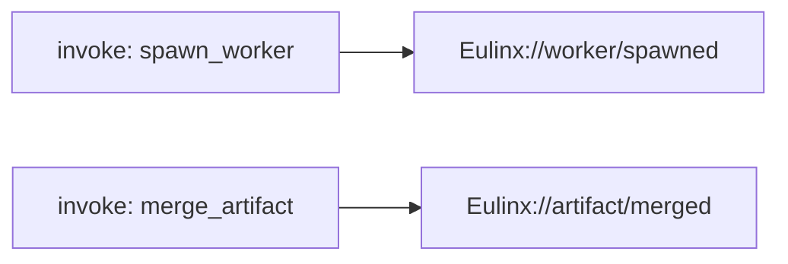
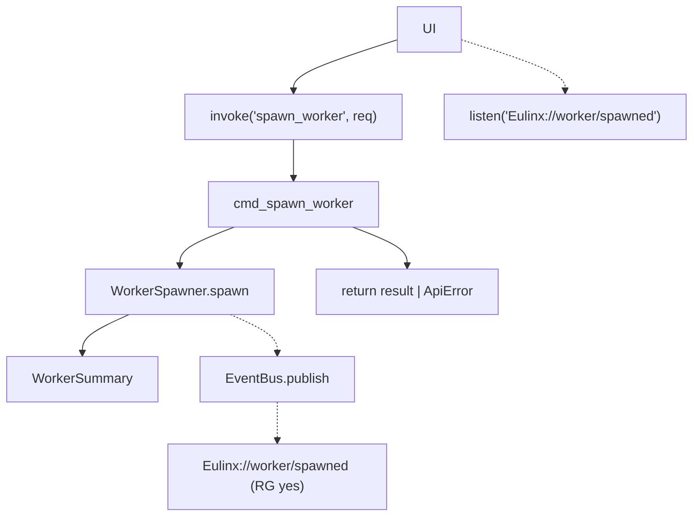
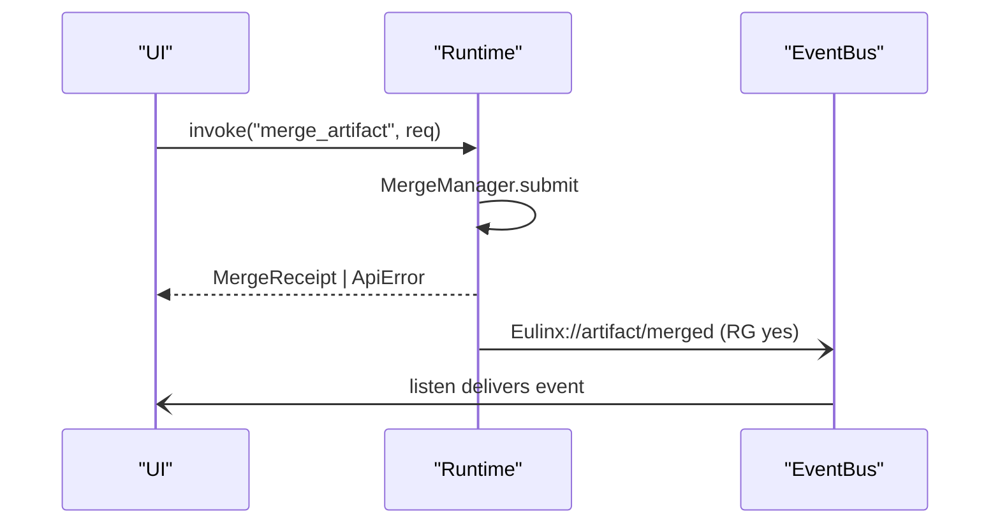
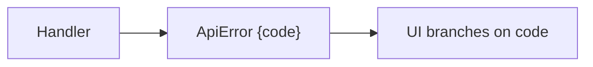
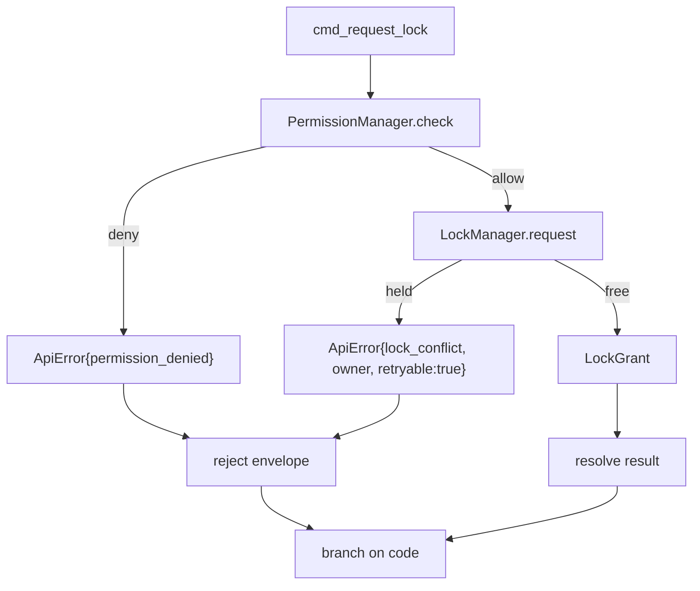
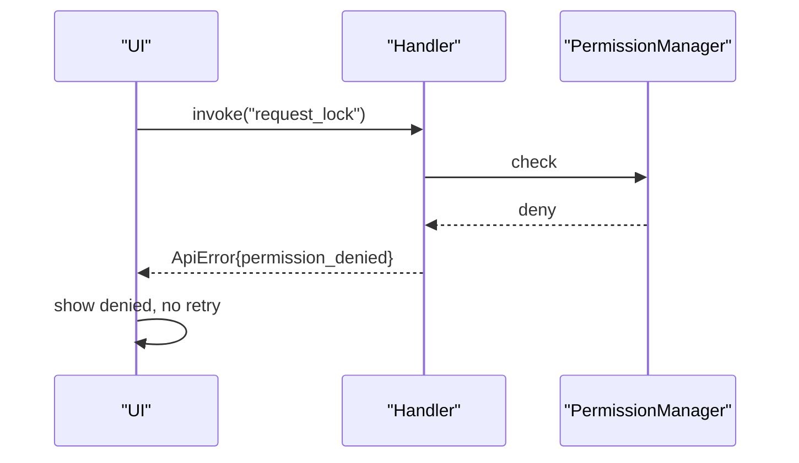
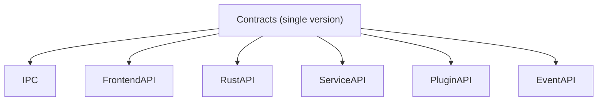
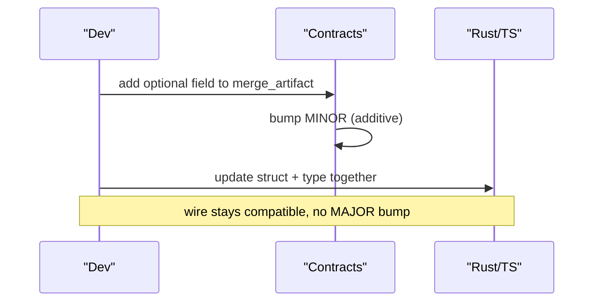

---
title: Contracts Diagrams
status: draft
version: 1.0
tags:
  - api
  - contracts
  - diagrams
related:
  - "[[Contracts-Part01]]"
  - "[[Contracts-Part02]]"
  - "[[Contracts-Part03]]"
  - "[[Contracts-Part04]]"
  - "[[Contracts-Part05]]"
  - "[[Contracts-Part06]]"
  - "[[15-api/README]]"
  - "[[IPC-Diagrams]]"
---

# Contracts Diagrams

Every flow below is rendered as overview mermaid, detailed mermaid, ASCII, and sequence.

## Command to Event Mapping

### Overview



### Detailed



### ASCII

```text
command (Contracts-Part01)        event (Contracts-Part02)
---------------------------        -------------------------
spawn_worker      -> WorkerSpawner -> Eulinx://worker/spawned
terminate_worker  -> WorkerSpawner -> Eulinx://worker/terminated
merge_artifact    -> MergeManager  -> Eulinx://artifact/merged
request_lock      -> LockManager   -> Eulinx://lock/granted | Eulinx://lock/denied
request_verification -> Verifier   -> Eulinx://artifact/verified

Every command result that succeeds is mirrored by a replay-grade event.
```

### Sequence



## Error Envelope Flow

### Overview



### Detailed



### ASCII

```text
Handler maps every failure to ApiError{code}:
  validation_error      (non-retryable, field named)
  workspace_scope_mismatch (non-retryable)
  permission_denied     (non-retryable)
  approval_required     (non-retryable)
  lock_conflict         (RETRYABLE, owner in context)
  merge_conflict        (RETRYABLE, conflict_ids)
  artifact_verify_failed (non-retryable)
  internal_error        (non-retryable, trace_id)
  runtime_unavailable   (non-retryable -> degraded UI)

UI branches on `code` only, never on `message`.
```

### Sequence



## Versioning Boundary

### Overview



### ASCII

```text
ONE API version (MAJOR.MINOR.PATCH) spans all six topics.

Breaking change anywhere -> MAJOR bump:
  - command renamed/removed (Part01)
  - event renamed/removed (Part02)
  - required field changed (Part03)
  - enum meaning changed (Part04)
  - error code removed/changed (Part05)

Additive change -> MINOR bump:
  - new command / event / optional field / error code

All three representations move together:
  Rust struct == TS type == internal type
```

### Sequence



## Related Documents

- [[Contracts-Part01]]
- [[Contracts-Part02]]
- [[Contracts-Part03]]
- [[Contracts-Part04]]
- [[Contracts-Part05]]
- [[Contracts-Part06]]
- [[15-api/README]]
- [[IPC-Diagrams]]
